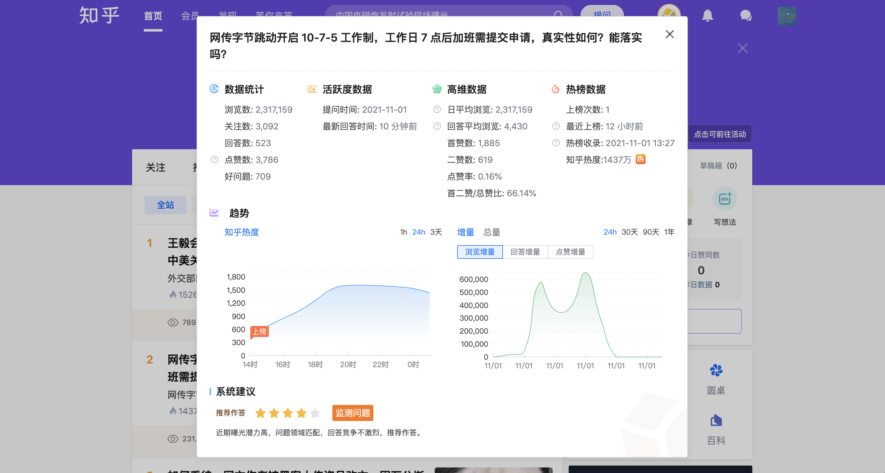
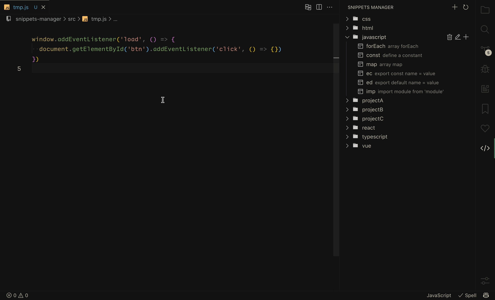

# 个人简历

## 基本信息
- **姓&nbsp;&nbsp;&nbsp;&nbsp;&nbsp;&nbsp;&nbsp;&nbsp;名**：秦光辉   
- **出生年月**：1994.09
- **教育背景**：西安交通大学 本科学历
- **所学专业**：能源与动力工程
- **工作经验**：3年前端开发（2年 Vue / 1年 React）
- **技术博客**：[https://www.qinguanghui.com/](https://www.qinguanghui.com/vue/)
- **期望城市**：湖北省武汉市（优先）
- **邮&nbsp;&nbsp;&nbsp;&nbsp;&nbsp;&nbsp;&nbsp;&nbsp;箱**：1248975357@qq.com
- **电&nbsp;&nbsp;&nbsp;&nbsp;&nbsp;&nbsp;&nbsp;&nbsp;话**：13125142026
- **微&nbsp;&nbsp;&nbsp;&nbsp;&nbsp;&nbsp;&nbsp;&nbsp;信**：z36180

## 个人优势

- 熟悉 Vue/React，研究过其实现原理，具备多个相关项目实战经验。[Vue源码笔记](https://www.qinguanghui.com/vue/)、[React源码笔记](https://www.qinguanghui.com/react/)
- 了解 Webpack/Rollup/Vite 基本原理。[Webpack源码笔记](https://www.qinguanghui.com/webpack/)
- 独立从零开发完成过多个前端项目，包括 PC 网页、浏览器插件、小程序等，具备较强的自学能力和解决问题能力。
- 态度勤恳，做事认真负责，遇到困难能主动专研解决。

## 工作经历

### 青藤云安全（2021年12月 ~ 至今）

- 负责公司内部组件库的开发与维护。

### 北京思拓合众科技有限公司（2020年7月 ~ 2021年9月）

- 负责前端项目开发，包括运营工具网页后台、浏览器插件、新知魔方小程序、私信系统等。
- 充分理解产品需求并进行项目排期，协调产品、设计和开发人员，推进产品研发进度。

### 上海有略科技有限公司（2018年6月 ~ 2019年4月）

- 独立负责微信小程序项目及其后台管理系统的搭建、开发、上线。
- 负责公司移动端官网开发，维护多个前端项目。

## 项目经验 

### 组件库

**使用技术**：React + TypeScript

**项目背景**：由于公司内部部分 `ui` 设计与交互逻辑与开源组件库不相同，部分需求开源组件库难以满足。因此，前端团队需要维护一套自己的组件库，包括基础样式库，基础组件库，通用组件库，以及业务组件库。

**项目经历**：
  - 文档升级：文档由 `storybook` 迁移至 `dumi`，并完善 `api` 与 `demo` 示例，解决编写 `demo` 成本高、 `api` 解释不全导致开发者难以使用组件库的问题。
  - 组件库升级：完成时间选择器、表单、级联选择器、高级搜索等多个组件，丰富和扩充其他组件的 `api`，提高开发者的开发效率。
  - 按需加载：组件库支持按需加载，经测试，在 mss 项目中组件库打包体积减少 35% 左右（1.15MB => 728 KB）。
  - 组件库前缀：组件库支持项目样式前缀，解决在联邦模块中多个项目中的组件库样式覆盖问题。
  - 修复bug：解决了 200+ issue，保证了其他项目的正常开发进度。
  <!-- - monorepo：解决调试困难，组件库版本不统一问题。 -->

**演示地址**：
  - todo

### 新知魔方运营工具

**使用技术**：Vue2 + ElementUI

**项目背景**：新知魔方运营工具是一款依托于知乎生态的工具。通过对知乎数据的整合和分析，形成独有的潜力问题库，热榜问题库，问题数据趋势图等功能模块，帮助知乎创作者快速高效地寻找具有曝光潜力的问题。

**项目经历**：

  - 从零规划项目结构，实现了绝大多数核心功能模块。并且封装了公用组件和公用函数，如权限指令封装，侧边栏组件封装等，确保了代码的可复用性和项目的可维护性。
   
  - 参与需求评审，充分理解产品需求，并多次提供比较合理的小建议。参与相关技术方案的确定，并对研发任务进行排期，确保研发进度正常进行。
   
  - 根据自身经验引导前端实习生解决棘手问题并纠正其存在的问题，平时也会一些分享优质前端内容给前端同事，构建一个良好的团队学习氛围。

**工具效果预览**：

### [新知魔方小插件](https://www.xinzhimofang.com/download.html)
**项目地址**：[chrome 插件地址](https://chrome.google.com/webstore/detail/%E6%96%B0%E7%9F%A5%E9%AD%94%E6%96%B9/hedbhjnengmmoddkcajcfdlaaiclkfdl?hl=zh)（目前该插件已停止维护）

**使用技术**：jQuery + Vue2 + ElementUI

**项目背景**：新知魔方小插件是一款浏览器插件，用于在知乎界面上进行界面增强，方便知乎创作者快速进行选题和选品操作。

**项目经历**：

1. 独立开发浏览器插件，研究浏览器插件与网页通信机制。通过插件实现网页实时抓取用户知乎数据的通用方案，减轻了服务端数据抓取压力。
   
2. 将 Webpack 应用于浏览器插件开发，利用 Vue 的模板开发特性代替 jQuery 开发，极大地提升了开发效率，并增加了代码的可读性和可复用性。

**插件预览**：

### 新知魔方私信系统

**使用技术**：Puppeteer + Node

**项目背景**：应公司运营人员需求，为给知乎创作者批量发送私信，需实现一个自动注册知乎账号、自动登录、自动浏览、自动发送私信的完整系统。

**项目经历**：

1. 研究技术实现方案，设计项目基本框架。对私信系统流程进行抽象，抽离并实现了浏览器管理、代理IP切换、验证码处理等基础类。除此之外，还解决了模拟器被识别导致无法正常登录、接码平台被封、程序异常运行等难题，保证了程序的正常运行。

2. 实现后台网页控制多个客户端程序的功能，包括客户端代码更新、客户端任务分配等。通过从本地启动或更新客户端到远程控制客户端的转变，极大降低了运营人员的操作难度。

## 其他经验

### VS Code 插件
 **项目地址**：[github](https://github.com/promise96319/snippets-manager/blob/master/README.md)

 **插件地址**：[vscode](https://marketplace.visualstudio.com/items?itemName=promise96319.snippets-manager)

 **开发背景**：
由于平时开发中存在大量相同或者类似的代码，比如通用的业务组件代码结构，比较繁琐的代码片段等等。每次寻找代码、copy、修改，一套流程下来，浪费了许多时间。如果用 `cli` 生成模板的话，修改和维护成本也比较高，有点舍本逐末。幸好 `VS Code` 自带代码片段功能，但是 `VS Code` 自带的代码片段属实有点难以编辑，也比较难以管理。找了相关的插件，发现都不大合心意，所以花了一个周末开发了这款插件。主要解决了我认为比较重要的两点问题：
   
- 编辑方便：直接选取源代码作为模板，更改自己需要替换的区域即可，比直接编写代码片段结构方便多了。
- 管理方便：代码片段能进行分组，根据不同的业务，不同的项目，或者不同的语言等来进行分组，便于管理。

 **插件预览**：

  

### iOS App
 2020 年疫情期间花一个月时间独立开发的一款 iOS App（ 使用`Swift`开发）。

 **App 展示**：

 

