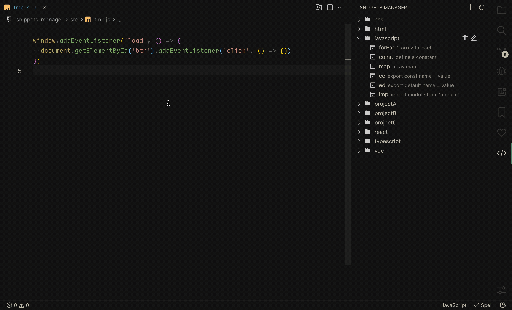
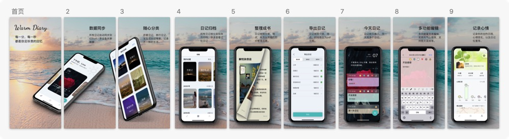
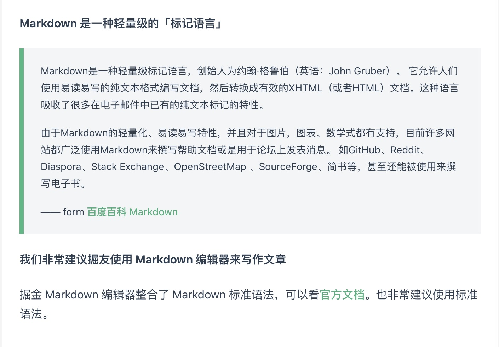

# 个人简历

## 基本信息

- **姓&nbsp;&nbsp;&nbsp;&nbsp;&nbsp;&nbsp;&nbsp;&nbsp;名**：秦光辉
- **出生年月**：1994.09
- **教育背景**：西安交通大学 本科学历
- **所学专业**：能源与动力工程
- **工作经验**：6年前端开发（2年 Vue / 4年 React）
- **技术博客**：[https://www.qinguanghui.com/](https://www.qinguanghui.com/vue/)
- **邮&nbsp;&nbsp;&nbsp;&nbsp;&nbsp;&nbsp;&nbsp;&nbsp;箱**：<1248975357@qq.com>
- **电&nbsp;&nbsp;&nbsp;&nbsp;&nbsp;&nbsp;&nbsp;&nbsp;话**：13125142026

## 个人优势

- 熟悉 React、Vue 实现原理，具备丰富实战经验。[Vue源码笔记](https://www.qinguanghui.com/vue/)、[React源码笔记](https://www.qinguanghui.com/react/)
- 熟悉组件库开发，具备较强的组件抽象能力以及解决问题能力。[组件库项目总结](https://www.qinguanghui.com/component/)
- 熟悉微前端架构实现原理，具备微前端改造迁移经验。[微前端项目总结](https://www.qinguanghui.com/micro-frontend/)

- 熟悉基础构建工具 Webpack，了解 Rollup、Vite 等。[Webpack源码笔记](https://www.qinguanghui.com/webpack/)
- 了解 Next.js、Nest.js，有服务端渲染、服务端开发经验。

## 工作经历

### 青藤云安全（2021年12月 ~ 至今） 基础架构前端开发

- 负责前端基础库标准化制定和开发维护。
- 负责微前端架构方案制定与落地。

### 北京思拓合众科技有限公司（

2020年7月 ~ 2021年9月） 高级前端开发

- 负责前端项目开发，包括运营工具网页后台、浏览器插件、新知魔方小程序、私信系统等。
- 根据产品需求进行项目排期，协调产品、设计和开发人员，推进产品研发进度。

### 上海有略教育科技有限公司（2018年6月 ~ 2019年4月）前端开发

- 独立负责微信小程序项目及其后台管理系统的搭建、开发、上线。
- 负责公司移动端官网开发，维护多个前端项目。

## 项目经验

### 组件库（2021.12 ~ 至今）

**使用技术**：React + TypeScript

**项目背景**：由于公司内部部分 `ui` 设计与交互逻辑与开源组件库不相同，部分需求开源组件库难以满足。因此，前端团队需要维护一套自己的组件库，包括基础样式库，基础组件库，通用组件库，以及业务组件库。

**项目经历**：

- 文档升级：文档由 `storybook` 迁移至 `dumi`，并完善 `api` 与 `demo` 示例，解决编写 `demo` 成本高、 `api` 解释不全导致开发者难以使用组件库的问题。
- 组件库升级：完成时间选择器、表单、级联选择器、高级搜索等多个组件，丰富和扩充其他组件的 `api`，提高开发者的开发效率。
- 按需加载：组件库支持按需加载，经测试，在 mss 项目中组件库打包体积减少 35% 左右（1.15MB => 728 KB）。
- 组件库前缀：组件库支持项目样式前缀，解决在联邦模块中多个项目中的组件库样式覆盖问题。
- 修复bug：解决了 200+ issue，保证了其他项目的正常开发进度。
  <!-- - monorepo：解决调试困难，组件库版本不统一问题。 -->

**演示地址**：

### 微前端架构改造（2023.11~2024.04）

**项目背景**：
公司原有项目采用联邦模块（Module Federation）组织多个子应用，随着业务规模扩张，逐渐暴露出样式冲突、JS 运行环境冲突、应用卸载重载顺序错乱等架构瓶颈，影响开发效率与线上稳定性，急需重重构微前端架构以支撑后续业务扩展。

**职责**：
- 主导微前端技术选型与架构方案设计。
- 推动新架构方案落地，协调多业务团队顺利迁移。
- 负责架构实施过程中的兼容性适配与性能优化。

**核心技术与行动**：
- 综合评估多种微前端方案，最终基于 qiankun v3，结合公司现有系统架构特性进行定制化改造。
- 结合 Shadow DOM 和 qiankun 沙箱机制，实现子应用样式隔离与运行环境完全隔离，有效解决跨应用样式与环境冲突问题。
- 深入排查并修复各业务线在新架构下的兼容性问题，制定并实施针对性解决方案。
- 设计统一的子应用接入规范和迁移文档，降低各业务线迁移成本。

**项目成果**：
- 新架构支持子应用低成本接入，迁移流程平均可在 0.5 天内完成，有效提升扩展效率。
- 新架构稳定支撑生产环境运行一年以上，并服务 20+ 子应用，未出现架构性故障；
- 子应用开发独立性大幅提升，有效提升整体开发协同效率。

### 组件库管理平台开发

### 自动化测试 id

### Electron 应用开发

## 其他经验

### VS Code 插件

 **项目地址**：[github](https://github.com/promise96319/snippets-manager/blob/master/README.md)

 **插件地址**：[vscode](https://marketplace.visualstudio.com/items?itemName=promise96319.snippets-manager)

 **开发背景**：
由于平时开发中存在大量相同或者类似的代码，比如通用的业务组件代码结构，比较繁琐的代码片段等等。每次寻找代码、copy、修改，一套流程下来，浪费了许多时间。如果用 `cli` 生成模板的话，修改和维护成本也比较高，有点舍本逐末。幸好 `VS Code` 自带代码片段功能，但是 `VS Code` 自带的代码片段属实有点难以编辑，也比较难以管理。找了相关的插件，发现都不大合心意，所以花了一个周末开发了这款插件。主要解决了我认为比较重要的两点问题：

- 编辑方便：直接选取源代码作为模板，更改自己需要替换的区域即可，比直接编写代码片段结构方便多了。
- 管理方便：代码片段能进行分组，根据不同的业务，不同的项目，或者不同的语言等来进行分组，便于管理。

 **插件预览**：

  

### iOS 应用开发

  **项目地址**：[github](https://github.com/promise96319/WarmDairy)

  **开发背景**：
  2020 年疫情期间闲着无聊，花一个月时间独立开发的一款 iOS App（ 使用`Swift`开发）。经历了从产品调研，到设计，到开发，到上架运营整个流程。虽然很累，但是成就感还是满满的。不仅让我学会了 Sketch，还收获了 200 大洋（虽然都不抵上架的费用 - -）

 **App 展示**：

 

### 掘金主题

 **项目地址**：[github](https://github.com/promise96319/juejin-markdown-theme-vuepress)

 **项目背景**：
偶然间发现掘金文章是能够更改主题的，当时博客用的 `vuepress` 搭建的，觉得色调还不错，所以在掘金加了个 `vuepress` 的主题

 

### 知乎浏览器插件
- 

### 小游戏开发
- cocos creator

