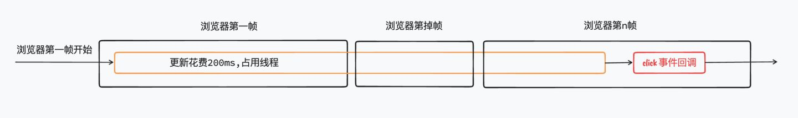
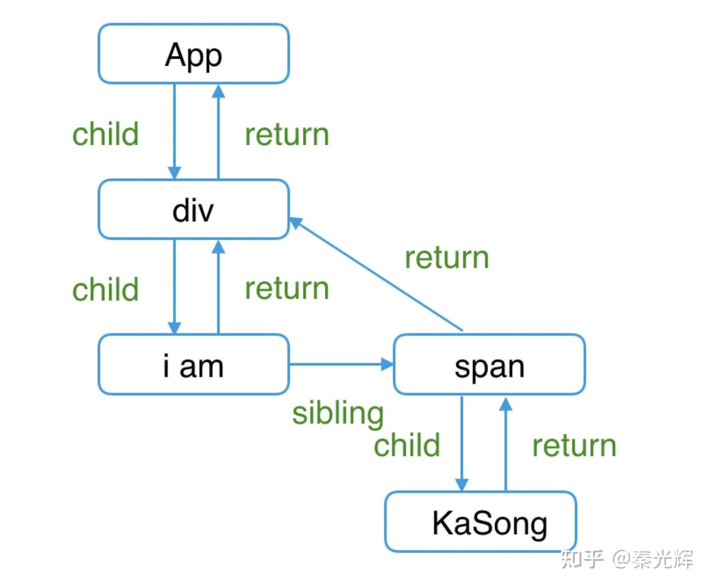
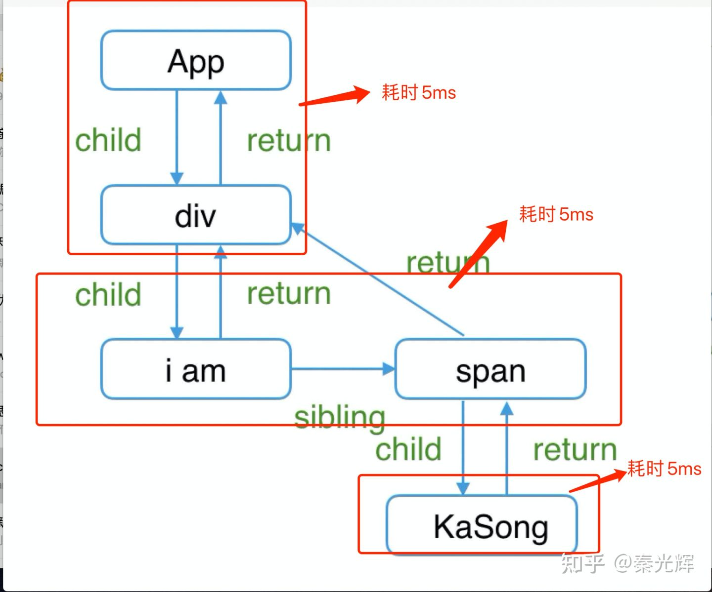
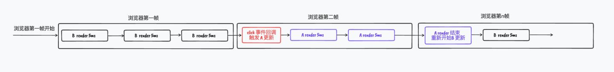
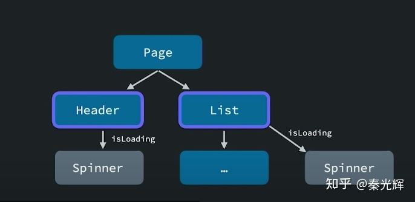

# React18 并发原理

## 0. 前言

前阵子，打磨已久的`React18`终于正式发布，其中最重要的一个更新就是**并发**（`concurrency`）。其他的新特性如`Suspense`、`useTransition`、`useDeferredValue` 的内部原理都是基于并发的，可想而知在这次更新中并发的重要性。


但是，并发究竟是什么？`React`团队引入并发又是为了解决哪些问题呢？它到底是如何去解决的呢？前面提到的`React18`新特性与并发之间又有什么关系呢？


相信大家在看官方文档或者看其他人描述`React`新特性时，或多或少可能会对以上几个问题产生疑问。因此，本文将通过分享`并发更新`的整体实现思路，来帮助大家更好地理解`React18`这次更新的内容。


## 1. 什么是并发

首先我们来看一下`并发`的概念：

并发，在操作系统中，是指一个时间段中有几个程序都处于已启动运行到运行完毕之间，且这几个程序都是在同一个处理机上运行，但**任一个时刻点上只有一个程序在处理机上运行**。

举个通俗的例子来讲就是：

- 你吃饭吃到一半，电话来了，你一直到吃完了以后才去接，这就说明你不支持并发也不支持并行。
- 你吃饭吃到一半，电话来了，你停了下来接了电话，接完后继续吃饭，这说明你支持并发。 
- 你吃饭吃到一半，电话来了，你一边打电话一边吃饭，这说明你支持并行。


并发的关键是具备处理多个任务的能力，但不是在同一时刻处理，而是交替处理多个任务。比如吃饭到一半，开始打电话，打电话到一半发现信号不好挂断了，继续吃饭，又来电话了...但是每次只会处理一个任务。


在了解了并发的概念后，我们现在思考下，在`React`中并发指的是什么，它有什么作用呢？

## 2. React 为什么需要并发

我们都知道，`js`是单线程语言，同一时间只能执行一件事情。这样就会导致一个问题，如果有一个耗时任务占据了线程，那么后续的执行内容都会被阻塞。比如下面这个例子：

```javascript
<button id="btn" onclick="handle()">点击按钮</button>

<script>
  // 用户点击事件回调
  function handle() {
    console.log('click 事件触发 ')
  }

  // 耗时任务，一直占用线程，阻塞了后续的用户行为
  function render() {
    for (let i = 0; i < 10 ** 5; i++) {
      console.log(i)
    }
  }
  window.onload = function () {
    render()
  }
</script>
```

当我们点击按钮时，由于`render`函数一直在执行，所以`handle`回调迟迟没有执行。对于用户来讲，界面是卡死且无法交互的。



如果我们把这个例子中的`render`函数类比成`React`的`更新过程`：即`setState`触发了一次更新，而这次更新耗时非常久，比如`200ms`。那么在这`200ms`的时间内界面是卡死的，用户无法进行交互，非常影响用户的使用体验。如下图所示，`200ms`内浏览器的渲染被阻塞，且用户的`click`事件回调也被阻塞。


那我们该如何解决这个问题呢？`React18`给出的答案就是：`并发`。


我们可以将`react更新`看作一个任务，`click`事件看作一个任务。在并发的情况下，`react更新`到一半的时候，进来了`click`任务，这个时候先去执行`click`任务。等`click`任务执行完成后，接着继续执行剩余的`react更新`。这样就保证了即使在耗时更新的情况下，用户依旧是可以进行交互的（`interactive`）。


虽然这个想法看上去非常不错，但是实现起来就有点困难了。比如更新到一半时怎么中断？更新中断了又怎么恢复呢？如果`click`又触发了`react`更新不就同时存在了两个更新了吗，它们的状态怎么区分？等等各种问题。


虽然很困难，但`React18`确实做到了这一点：

> Concurrency is not a feature, per se. It’s a new behind-the-scenes mechanism that enables React to prepare multiple versions of your UI at the same time. 

正如官网中描述的：`并发`是一种新的幕后机制，它允许在同一时间里，准备多个版本的`UI`，即多个版本的更新，也就是前面我们提到的并发。下面我们将逐步了解`React`是怎么实现`并发`的。


## 3. 浏览器的一帧里做了什么？

首先，我们需要了解一个前置知识点——`window.requestIdleCallback`。它的功能如下：

> **window.requestIdleCallback()**方法插入一个函数，这个函数将在浏览器空闲时期被调用。

网上有许多文章在聊到`React`的`调度（schedule）和时间切片（time slicing）`的时候都提到了这个`api`。那么这个`api`究竟有什么作用呢？浏览器的空闲时间又是指的什么呢？


带着这个疑问，我们看看浏览器里的一帧发生了什么。我们知道，通常情况下，浏览器的一帧为`16.7ms`。由于`js`是单线程，那么它内部的一些事件，比如 `click`事件，宏任务，微任务，`requestAnimatinFrame`，`requestIdleCallback`等等都会在浏览器帧里按一定的顺序去执行。具体的执行顺序如下：


(图片来自[这里](https://medium.com/@paul_irish/requestanimationframe-scheduling-for-nerds-9c57f7438ef4))

我们可以发现，浏览器一帧里回调的执行顺序为：

1. 用户事件：最先执行，比如`click`等事件。
2. `js`代码：宏任务和微任务，这段时间里可以执行多个宏任务，但是必须把微任务队列执行完成。宏任务会被浏览器自动调控。比如浏览器如果觉得宏任务执行时间太久，它会将下一个宏任务分配到下一帧中，避免掉帧。
3. 在渲染前执行 `scroll/resize` 等事件回调。
4. 在渲染前执行`requestAnimationFrame`回调。
5. 渲染界面：面试中经常提到的浏览器渲染时`html、css`的计算布局绘制等都是在这里完成。
6. `requestIdleCallback`执行回调：如果前面的那些任务执行完成了，一帧还剩余时间，那么会调用该函数。

从上面可以知道，`requestIdleCallback`表示的是浏览器里每一帧里在确保其他任务完成时，还剩余时间，那么就会执行`requestIdleCallback`回调。比如其余任务执行了`10ms`，那么这一帧里就还剩`6.7ms`的时间，那么就会触发`requestIdleCallback`的回调。


了解了这个方法后，我们可以做一个假设：如果我们把`React`的更新（如`200ms`）拆分成一个个小的更新（如`40 个 5ms 的更新`），然后每个小更新放到`requestIdleCallback`中执行。那么就意味着这些小更新会在浏览器每一帧的空闲时间去执行。如果一帧里有多余时间就执行，没有多余时间就推到下一帧继续执行。这样的话，更新一直在继续，并且同时还能确保每一帧里的事件如`click，宏任务，微任务，渲染`等能够正常执行，也就可以达到用户可交互的目的。


但是，`requestIdleCallback`的兼容性太差了：


因此，`React`团队决定自己实现一个类似的功能：时间切片（`time slicing`）。接下来我们看看时间切片是如何实现的。


## 4. 时间切片

假如`React`一个更新需要耗时`200ms`，我们可以将其拆分为`40`个`5ms`的更新（后续会讲到如何拆分），然后每一帧里只花`5ms`来执行更新。那么，每一帧里不就剩余`16.7 - 5 = 11.7ms`的时间可以进行`用户事件`，`渲染`等其他的`js`操作吗？如下所示：


那么这里就有两个问题：

- 问题1：如何控制每一帧只执行`5ms`的更新？
- 问题2：如何控制`40`个更新分配到每一帧里？


对于问题1比较容易，我们可以在更新开始时记录`startTime`，然后每执行一小段时间判断是否超过`5ms`。如果超过了`5ms`就不再执行，等下一帧再继续执行。


对于问题2，我们可以通过宏任务实现。比如`5ms`的更新结束了，那么我们可以为下一个`5ms`更新开启一个宏任务。浏览器则会将这个宏任务分配到当前帧或者是下一帧执行。

注意：

浏览器这一行为是内置的，比如设置 10000 个 setTimeout(fn, 0)，并不会阻塞线程，而是浏览器会将这 10000 个回调合理分配到每一帧当中去执行。

比如：10000个个 setTimeout(fn, 0)在执行时，第一帧里可能执行了300个 setTimeout 回调，第二帧里可能执行了400个 setTimeout 回调，第 n 帧里可能执行了 200 个回调。浏览器为了尽量保证不掉帧，会合理将这些宏任务分配到帧当中去。


解决了上面两个问题，那么这个时候我们就有下面这种思路了：

1. 更新开始，记录开始时间 `startTime`。
2. `js` 代码执行时，记录距离开始时间`startTime`是否超过了 `5ms`。
3. 如果超过了 `5ms`，那么这个时候就不应该再以同步的形式来执行代码了，否则依然会阻塞后续的代码执行。
4. 所以这个时候我们需要把后续的更新改为一个宏任务，这样浏览器就会分配给他执行的时机。如果有用户事件进来，那么会执行用户事件，等用户事件执行完成后，再继续执行宏任务中的更新。


如上图所示，由于更新拆分成了一个个小的宏任务，从而使得`click`事件的回调有机会执行。


现在我们已经解决了更新阻塞的问题，接下来就需要解决如何将一个完整的更新拆分为多个更新，并且让它可以暂停等到`click`事件完成后再回来更新。

## 5. Fiber 架构

`React`传统的`Reconciler`是通过类似于`虚拟DOM`的方式来进行对比和标记更新。而`虚拟DOM`的结构不能很好满足将更新拆分的需求。因为它一旦暂停对比过程，下次更新时，很难找到上一个节点和下一个节点的信息，虽然有办法能找到，但是相对而言比较麻烦。所以，`React`团队引入了`Fiber`来解决这一问题。


每一个`DOM`节点对应一个`Fiber`对象，`DOM`树对应的`Fiber`结构如下：



(图片来自于[这里](https://space.bilibili.com/453618117?spm_id_from=333.337.0.0))

`Fiber`通过`链表`的形式来记录节点之间的关系，它与传统的虚拟`DOM`最大的区别是多加了几个属性：

- `return`表示父节点`fiber`。
- `child`表示子节点的第一个`fiber`。
- `sibling`表示下一个兄弟节点的`fiber`。

通过这种链表的形式，可以很轻松的找到每一个节点的下一个节点或上一个节点。那么这个特性有什么作用呢？


结合上面提到的时间切片的思路，我们需要判断更新是否超过了`5ms`，我们以上面这棵`Fiber`树梳理一下更新的思路。从`App Fiber`开始：

- 浏览器第一帧：

- - 记录更新开始时间`startTime`。

- - 首先计算`App`节点，计算完成时，发现更新未超过`5ms`，继续更新下一个节点。
  - 计算`div`节点，计算完成时，发现更新超过了`5ms`，那么不会进行更新，而是开启一个宏任务。

- 浏览器第二帧：

- - **上一帧最后更新的是div节点**，找到下一个节点`i am`，计算该节点，发现更新未超过`5ms`，继续更新下一个节点。
  - 计算`span`节点，发现更新超过了`5ms`，那么不会进行更新，而是开启一个宏任务。

- 浏览器第三帧：

- - **上一帧最后更新的是span节点**，找到下一个节点`KaSong`，计算该节点，更新完成。



注：

1. 实际的更新过程是 beginWork / completeWork 递与归的阶段，与这里有出入，这里仅做演示介绍。
2. 这里的更新过程有可能不是第二帧和第三帧，而是在一帧里执行完成，具体需要看浏览器如何去分配宏任务。
3. 更新过程分为 reconciler 和 commit 阶段，这里只会将 reconciler 阶段拆分。而 commit 阶段是映射为真实 DOM，无法拆分。

对应浏览器中的执行过程如下：


在这个过程中，每个节点计算完成后都会去校验更新时间是否超过了`5ms`，然后找到下一个节点继续计算，而双向链表恰恰是切合这种需求。


## 6. 小结

通过上面的分析，我们可以总结成以下思路：

1. 更新时遍历更新每一个节点，每更新一个`Fiber节点`后，会判断累计更新时间是否超过`5ms`。
2. 如果超过`5ms`，将下一个更新创建为一个宏任务，浏览器自动为其分配执行时机，从而不阻塞用户事件等操作。
3. 如果更新的过程中，用户进行触发了点击事件，那么会在`5ms`与下一个`5ms`的间隙中去执行`click`事件回调。


通过以上步骤，我们能够将现有的**同步更新转变为多个小更新分配到浏览器帧里，并且不会阻塞用户事件**。接下来看看在`React`中实际是如何做到的。


## 7. Scheduler调度

在`React`中，有一个单独的`Scheduler`库专门用于处理上面讨论的时间切片。


我们简单看一下`Scheduler`关键源码实现：

1. 首先，在 `packagegs/react-reconciler/src/ReactFiberWorkLoop.new.js` 文件中：

```javascript
// 循环更新 fiber 节点
function workLoopConcurrent() {
  while (workInProgress !== null && !shouldYield()) {
    // 更新单个 fiber 节点
    performUnitOfWork(workInProgress);
  }
}
```

在更新时，如果是`Concurrent`模式，低优先级更新会进入到`workLoopConcurrent`函数。该函数的作用就是遍历`Fiber`节点，创建`Fiber`树并标记哪些`Fiber`被更新了。`performUnitOfWork`表示的是对每个`Fiber`节点的处理操作，每次处理前都会执行`shouldYield()`方法，下面看一下`shouldYield`。


2. 其次，在 `packages/scheduler/src/forks/Scheduler.js`文件中：

```javascript
export const frameYieldMs = 5;
let frameInterval = frameYieldMs;

function shouldYieldToHost() {
  const timeElapsed = getCurrentTime() - startTime;
  // 判断时间间隔是否小于 5ms
  if (timeElapsed < frameInterval) {
    return false;
  }
  ...
}
```

`shouldYield()`方法会去判断累计更新的时间是否超过`5ms`。


3. 最后，在 `packages/scheduler/src/forks/Scheduler.js`文件中：

```javascript
let schedulePerformWorkUntilDeadline;
if (typeof localSetImmediate === 'function') {
  schedulePerformWorkUntilDeadline = () => {
    localSetImmediate(performWorkUntilDeadline);
  };
} else if (typeof MessageChannel !== 'undefined') {
  const channel = new MessageChannel();
  const port = channel.port2;
  channel.port1.onmessage = performWorkUntilDeadline;
  schedulePerformWorkUntilDeadline = () => {
    port.postMessage(null);
  };
} else {
  schedulePerformWorkUntilDeadline = () => {
    localSetTimeout(performWorkUntilDeadline, 0);
  };
}
```

如果超过了`5ms`，就会通过`schedulePerformWorkUntilDeadline`开启一个宏任务进行下一个更新。这里`react`做了兼容的处理，实际上是优先使用`MessageChannel`而不是`setTimeout`，这是因为在浏览器帧中`MessageChannel`更优先于`setTimeout`执行。


总的来说，`Scheduler`库的处理和前面讨论的时间切片类似。事实上，浏览器也正在做同样的`Scheduler`库做的事情：通过内置一个`api`——[scheduler.postTask](https://chromestatus.com/feature/6031161734201344) 来解决用户交互在某些情况下无法即时相应的问题，有兴趣的话可以看看相关内容。


最终，通过这种时间切片的方式，在浏览器下的`performance`面板中，会呈现出如下渲染过程：原本一个耗时的更新（如渲染`10000`个`li`标签），被分割为一个个`5ms`的小更新：


到这里，我们已经清楚了如何让一个耗时的更新不去阻塞`用户事件和渲染`了。但是这只是有一个更新任务的情况，如果在`React`更新一半时，`click`事件进来，然后执行`click`事件回调，并且触发了新的更新，那么该如何处理共存的两个更新呢？如果`click`事件的更新过程中，又有其他的`click`事件触发更新呢？这就涉及到多个更新并存的情况，这也是我们接下来需要讨论的点。


## 8. 更新优先级

在`React`中，更新分为两种，紧急更新和过渡更新：

- 紧急更新(`Urgent updates`)：用户交互等，比如`点击`，`输入`，`按键`等等，由于直接影响到用户的使用体验，属于紧急情况。
- 过渡更新（`Transition updates`）：如从一个界面过渡到另一个界面，属于非紧急情况。


对于用户体验来讲，紧急更新应该是优先于非紧急更新的。例如用`input`搜索时，我们应该确保用户输入的内容是能够是实时响应的，而根据输入值搜索出来的内容在渲染更新的时候不应该阻塞用户的输入。


这里就回到了上面提到的多更新并存的问题：哪些更新优先级高，哪些更新优先级低，哪些更新需要立即去执行，哪些更新可以缓一缓再执行。


为了解决这个问题，`React`为通过`lane`的方式每个更新分配了相关优先级。`lane`可以简单理解为一些数字，数值越小，表明优先级越高。但是为了计算方便，采用二进制的形式来表示。比如我们在判断一个状态的更新是否属于当前更新时，只需要判断`updateLanes & renderLanes`即可。


在`react-reconciler/src/ReactFiberLane.new.js` 文件中，里面一共展示了`32`条`lane`：

```javascript
export const TotalLanes = 31;

export const NoLanes: Lanes = /*                        */ 0b0000000000000000000000000000000;
export const NoLane: Lane = /*                          */ 0b0000000000000000000000000000000;

// 同步
export const SyncLane: Lane = /*                        */ 0b0000000000000000000000000000001;

// 连续事件
export const InputContinuousHydrationLane: Lane = /*    */ 0b0000000000000000000000000000010;
export const InputContinuousLane: Lanes = /*            */ 0b0000000000000000000000000000100;

// 默认
export const DefaultHydrationLane: Lane = /*            */ 0b0000000000000000000000000001000;
export const DefaultLane: Lanes = /*                    */ 0b0000000000000000000000000010000;

// 过渡
const TransitionHydrationLane: Lane = /*                */ 0b0000000000000000000000000100000;
const TransitionLanes: Lanes = /*                       */ 0b0000000001111111111111111000000;
const TransitionLane1: Lane = /*                        */ 0b0000000000000000000000001000000;
const TransitionLane2: Lane = /*                        */ 0b0000000000000000000000010000000;
const TransitionLane3: Lane = /*                        */ 0b0000000000000000000000100000000;
const TransitionLane4: Lane = /*                        */ 0b0000000000000000000001000000000;
const TransitionLane5: Lane = /*                        */ 0b0000000000000000000010000000000;
const TransitionLane6: Lane = /*                        */ 0b0000000000000000000100000000000;
const TransitionLane7: Lane = /*                        */ 0b0000000000000000001000000000000;
const TransitionLane8: Lane = /*                        */ 0b0000000000000000010000000000000;
const TransitionLane9: Lane = /*                        */ 0b0000000000000000100000000000000;
const TransitionLane10: Lane = /*                       */ 0b0000000000000001000000000000000;
const TransitionLane11: Lane = /*                       */ 0b0000000000000010000000000000000;
const TransitionLane12: Lane = /*                       */ 0b0000000000000100000000000000000;
const TransitionLane13: Lane = /*                       */ 0b0000000000001000000000000000000;
const TransitionLane14: Lane = /*                       */ 0b0000000000010000000000000000000;
const TransitionLane15: Lane = /*                       */ 0b0000000000100000000000000000000;
const TransitionLane16: Lane = /*                       */ 0b0000000001000000000000000000000;

// 重试
const RetryLanes: Lanes = /*                            */ 0b0000111110000000000000000000000;
const RetryLane1: Lane = /*                             */ 0b0000000010000000000000000000000;
const RetryLane2: Lane = /*                             */ 0b0000000100000000000000000000000;
const RetryLane3: Lane = /*                             */ 0b0000001000000000000000000000000;
const RetryLane4: Lane = /*                             */ 0b0000010000000000000000000000000;
const RetryLane5: Lane = /*                             */ 0b0000100000000000000000000000000;

export const SomeRetryLane: Lane = RetryLane1;

export const SelectiveHydrationLane: Lane = /*          */ 0b0001000000000000000000000000000;

const NonIdleLanes = /*                                 */ 0b0001111111111111111111111111111;

export const IdleHydrationLane: Lane = /*               */ 0b0010000000000000000000000000000;
export const IdleLane: Lanes = /*                       */ 0b0100000000000000000000000000000;

// 离屏
export const OffscreenLane: Lane = /*                   */ 0b1000000000000000000000000000000;
```

不同的`lane`表示不同的更新优先级。比如用户事件比较紧急，那么可以对应比较高的优先级如`SyncLane`；`UI`界面过渡的更新不那么紧急，可以对应比较低的优先级如`TransitionLane`；网络加载的更新也不那么紧急，可以对应低优先级`RetryLane`，等等。


通过这种优先级，我们就能判断哪些更新优先执行，哪些更新会被中断滞后执行了。举个例子来讲：假如有两个更新，他们同时对`App`组件的一个`count`属性更新：

```javascript
<p>You clicked {count} times</p>
<button onClick={() => setCount(count + 1)}>
  A按钮
</button>
<button onClick={() => startTransition(() => { setCount(count + 1) })}>
  B按钮
</button>
```

- 一个是`A`按钮：`click`事件触发的更新，叫做`A更新`，对应于`SyncLane`。
- 一个是`B`按钮：`startTransition`触发的更新，叫做`B更新`，对应于`TransitionLane1`。


假设`B`按钮先点击， `B更新`开始，按照之前提到时间切片的形式进行更新。中途触发了`A`按钮点击，进而触发`A更新`。那么此时就会通过`lane`进行对比，发现`DefaultLane`优先级高于`TransitionLane1`。此时会中断`B更新`，开始`A更新`。直到`A`更新完成时，再重新开始`B`更新。




那么`React`是如何区分`B更新`对`App`的`count`的更改和`A更新`中对`count`的更改呢？


实际上，在每次更新时，更新 `state`的操作会被创建为一个 `Update`，放到循环链表当中：

```javascript
export function createUpdate(eventTime: number, lane: Lane): Update<*> {
  const update: Update<*> = {
    eventTime,
    lane,

    tag: UpdateState,
    payload: null,
    callback: null,

    next: null,
  };
  return update;
}
```

在更新的时候就会依次去执行这个链表上的操作，从而计算出最终的`state`。


从`Update`的定义可以注意到，每个`Update`里都有一个`lane`属性。该属性标识了当前的这个`Update`的更新优先级，属于哪个更新任务中的操作。


因此当`A更新`在执行的时候，我们在计算`state`的时候，只需要去计算与`A更新`相同`lane`的`update`即可。同样，`B更新`开始，也只更新具有同等`lane`级别的`Update`，从而达到不同更新的状态互不干扰的效果。


## 9. React18 并发渲染

回顾一下前面讨论的`React并发渲染`：

1. 为什么需要并发？

  1. 因为我们期望一些不重要的更新不会影响用户的操作，比如长列表渲染不会阻塞用户`input`输入，从而提升用户体验。

2. 并发模式是怎样的？

  1. 在多个更新并存的情况下，我们需要根据更新优先级，优先执行紧急的更新，其次再执行不那么紧急的更新。比如优先响应`click`事件触发的更新，其次再响应长列表渲染的更新。

3. 并发模式是如何实现的？

  1. 对于每个更新，为其分配一个优先级`lane`，用于区分其紧急程度。
  2. 通过`Fiber`结构将不紧急的更新拆分成多段更新，并通过宏任务的方式将其合理分配到浏览器的帧当中。这样就能使得紧急任务能够插入进来。
  3. 高优先级的更新会打断低优先级的更新，等高优先级更新完成后，再开始低优先级更新。

## 10. 新特性

接下来看看`React18`部分`并发`相关的新`api`。

### Suspense

在`v16/v17`中，`Suspense`主要是配合`React.lazy`进行`code spliting`。在`v18`中，`Suspense`加入了`fallback`属性，用于将`读取数据`和`指定加载状态`分离。那么这种分离有什么好处呢？

举一个例子：

```jsx
function List({ pageId }) {
  const [data, setData] = useState([])
  const [isLoading, setIsLoading] = useState(false)
  
  useEffect(() => {
    setIsLoading(true)
    fetchData(pageId).then((data) => {
      setData(data)
      setIsLoading(false)
    })
  }, [])
  
  if (isLoading) {
    return <Spinner />
  }
  
  return data[pageId].map(item => <li>{item}</li>)
}
```

这是我们最常见的处理异步数据的方式。虽然看上去还能接受，但实际上会有一些问题：

1. 存储了两套数据`isLoading/data`和两种渲染结果，并且代码比较冗余，不利于开发维护。如果用`Suspense`，可以直接读取数据而不关心加载状态，如：

```jsx
const wrappedData = unstable_createResource((pageId) => fetchData(pageId))

function List({ pageId }) {
  const data = wrappedData.read(pageId)
  
  return data[pageId].map(item => <li>{item}</li>)
}


// 在需要使用 List 组件的地方包裹一层  Suspense 即可自动控制加载抓昂太
<Suspense fallback={<div>Loading...</div>}>
  <List />
</Suspense>
```

可以看出使用`Suspense`后代码变得简洁清晰易懂，对于开发效率和代码维护性都有很大的提升。


1. 另外一个问题：如果有两个组件`Header`和`List`，它们分别有自己的`loading`状态。现在我们想要把这两个`loading`状态合并在一起，放到`page`里。如下所示：



如果按照传统的方式，我们需要将大量的代码移动到上一层`page`里。但是在`React18`里，`Suspense`能够很轻松的解决这一问题：

```jsx
<Suspense fallback={<Skeleton />}>
  <Header />
  <List pageId={pageId} />
</Suspense>
```

如果`Header`组件和`List`组件都在请求数据当中，那么就会显示`Skeleton`组件。如果我们想给`List`组件添加一个单独的占位组件，只需要再套一层`Suspense`即可实现，无需对数据进行做特殊处理。

```jsx
<Suspense fallback={<Skeleton />}>
  <Header />
  <Suspense fallback={<ListPlaceholder />}>
    <List pageId={pageId} />
  </Suspense>
</Suspense>
```

可以看出，`Suspense`通过数据和加载状态分离的方式，极大地简化了加载状态的处理。


下面我们看另外一个实际的`Suspense`使用案例，了解下`Suspense`如何实现的：

```tsx
import React, { Suspense } from 'react'
import { unstable_createResource } from 'react-cache'
import { request } from './utils/api'

const data = unstable_createResource(data => request(data))

const AsyncComponent = () => {
  const res = data.read(10000)
  return (
    <ul>
      {new Array(res).fill(0).map((_, i) => (
        <li key={i}>{i}</li>
      ))}
    </ul>
  )
}

const SuspenseComp = () => (
  <Suspense fallback={<div>Loading...</div>}>
    <AsyncComponent />
  </Suspense>
)

export default SuspenseComp
```

在数据读取时我们需要对数据加载的`promise`通过`unstable_createResource`方法进行一层封装。其核心目的是为了在`promise`处于`pending`状态时会抛出错误，将`promise`抛出，而`Suspense`组件会去捕捉这个`promise`，从而显示`fallback`。并在`promise.then`方法中重新触发更新。伪代码如下：

```jsx
// 抛出错误
unstable_createResource(promise) {
  // 数据没加载完成，抛出 promise
  if (promise.status === pending) {
    throw promise
  }
  // 数据加载完成，返回加载完的结果
  if (promise.status === fulfilled) {
    return promise.result
  }
}

// Suspense 捕捉错误，捕捉到抛出的 promise，并添加更新
promise.then(() => { 
  renderAgain()
})
```

需要注意的是，`Suspense`捕捉错误后触发的更新为低优先级更新，会通过时间切片的形式去更新，因此不会阻塞用户交互和渲染流程，这也是前面提到的并发更新的一个实际应用。


### useTransition/useDeferredValue

`useTransition`和`useDeferredValue`其实功能上相差不太多，都是通过时间切片的形式进行更新。关于它们之间的区别，`react`有做相关描述：

It's tricky. We didn't document useDeferredValue precisely because we don't know how to explain it well yet. So I won't be able to come up with a great explanation on the spot.


startTransition requires you to have access to the place where state is being *set*. In long term it'll likely mostly be used by code like routers (page navigations) or data fetching libraries (refetching data). Whereas useDeferredValue can be used anywhere because it only takes a value — it doesn't care where the state was set.

`useDeferredValue`不关心输数据在哪里设置的，它主要用于将一些紧急的事转换为非紧急的事。而`useTransition`未来可能会用于`page navigations`或数据获取库等。


那么这两个`hook`在实际中有什么作用呢？我们看一个实际例子：

```jsx
import React, { useState, useDeferredValue } from 'react'

const Defer = () => {
  const [searchValue, setSearchValue] = useState(100)
  const deferredSearchValue = useDeferredValue(searchValue)
  
  return (
    <>
      <input
        type="number"
        value={searchValue}
        onChange={(e) => {
          setSearchValue(Number(e.target.value) || 0)
        }}
      />
      
      {new Array(deferredSearchValue).fill(0).map((_, idx) => (
        <li key={idx}>{idx}</li>
      ))}
      {/* {new Array(searchValue).fill(0).map((_, idx) => (
      <li key={idx}>{idx}</li>
      ))} */}
    </>
  )
}

export default Defer
```

在`input`内容改变时，会根据输入内容去渲染一个比较耗时的列表。

- 在传统模式下，由于渲染列表占据了线程，导致用户输入时，无法立即响应。
- 而在`React18`中使用`useDeferredValue`，会将`列表渲染的更新`置为低优先级更新。并且当`input`值快速变化的时候，`React`会合并触发的更新，渲染最后的一个更新。

那么`useDeferredValue`与防抖节流有什么区别呢？

首先看一下防抖，比如触发`onChange`事件时，通过`setTimeout`设置`100ms`的延迟：

```jsx
onChange={(value) => {
  clearTimeout(timer)
  timer = setTimeout(() => {
    setSearchValue(value)
  }, 100)
}}
```

虽然这已经很好的解决了频繁触发渲染的问题，但是还是会存在一些小问题。比如列表渲染非常快时，远远小于`100ms`，但是却需要等待到`100ms`后才会开始执行更新。当然，我们也可以尝试节流来解决频繁渲染问题，但是防抖节流却都无法解决更新耗时过长的问题。比如列表渲染需要耗时`1s`，那么在这`1s`内用户依旧无法去交互。


而`useTransition/useDeferredValue`很好的解决了这一问题，可以看一下这两个`hook`源码中比较关键的一部分如下：

```javascript
const prevTransition = ReactCurrentBatchConfig.transition;
// 每次更新之前，改变优先级，为 transition 优先级
ReactCurrentBatchConfig.transition = {};
try {
  setValue(value);
} finally {
  ReactCurrentBatchConfig.transition = prevTransition;
}
```

在每次更新之前，会将优先级更新为`transition`，属于低优先级更新，通过时间切片的形式去更新，从而不阻塞其他紧急的渲染。这在一些耗时渲染和`CPU`性能相对不高的场景下还是比较有用的，能够稳定保证用户界面是可交互的。

### useSyncExternalStore

前面提到的几个新`API`都是通过并发更新的形式解决渲染阻塞的问题，但是并发同样会带来新的问题。


比如我们将一个低优先级更新拆分成了`40`个小更新，并且这`40`个小更新里需要获取全局变量，比如`globalVariable = 1`。当前`20`个小更新完成时，这个时候用户点击事件触发，将`globalVariable`设置为`2`，那么后续`20`个小更新在获取这个变量时与前`20`个更新不一致。这就造成了一个界面对于同一个变量却渲染出了`2`个值，出现不一致的情况。这种情况我们称之为`tearing`。


为了解决这一问题，`React`提供了`useSyncExternalStore`。它相当于对并发更新使用到的`额外`数据进行监听，当并发更新时数据发生变化，进行强制渲染：

```jsx
function updateStoreInstance<T>(
  fiber: Fiber,
  inst: StoreInstance<T>,
  nextSnapshot: T,
  getSnapshot: () => T,
) {
  
  ...
  
  if (checkIfSnapshotChanged(inst)) {
    // Force a re-render.
    forceStoreRerender(fiber);
  }
}
```

当然，这个`api`是给库作者提供的，用于将库深度整合到`React`当中，通常不会用于实际业务开发当中。


至此，`React18`的并发原理及相关特性分享完了。总的来说，`React18`这次的更新大都是底层内容的更新，实际的 `api` 变动并不是很大。对于开发者来讲，虽然可以很快上手这些新的 `api`，但是却越来越难以理解背后的一些原理了。


最后，以上部分内容包含我个人的理解，难免存在一些理解上的偏差，如果有错误的地方欢迎大家指正。如果你有什么问题也欢迎讨论。


## 11. 源码调试

最后附上[react v18.0.0](https://github.com/promise96319/React18-debug)的源码调试仓库，该仓库对`react 源码`做了一点处理，可以直接对源码进行`debug`调试，相对比较方便。
