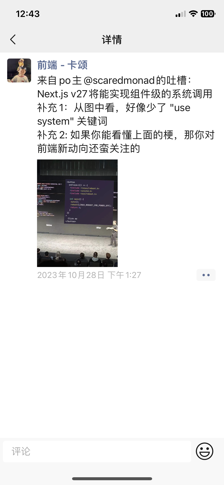
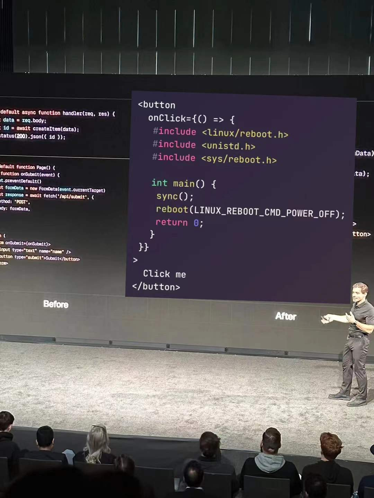

# React Server Component

## 前言

前段时间在看到一个关于 Next.js 的梗，大家看下能不能看懂这个梗~

<div style="display: flex; height: 400px;">
  
  
</div>

如果大家没有接触 Next.js 的话，可能比较难看懂这个梗。Next.js 里面集成了许多 React 的最新特性，其中就包含上面这张图提出的类似特性 -- server action。

其实 RSC 这个概念早在两年前 React 团队就提出来了，不过一直是处于试验中的状态。比如，我们现在可以看到在 React 官网上，有许多带有试验图标的 API，这些 API 都是和 RSC 这个概念相关的，这也是为什么文本以 RSC 为主要内容。

但是，目前我们还无法直接使用这些特性，而是需要借助到其他框架，比如 Next.js。Next.js v14 版本基本上完全支持这些新特性，而且 Next.js 也是 React 官方推荐的框架。

由于平时我们接触服务端渲染的机会有限，相信大家对 React 的这些新内容还比较陌生。正好前阵子我用 Next.js 开发了组件库管理平台，也踩了许多坑，了解了相关的知识。所以，希望能够通过 RSC 这个概念帮助大家了解到 React 的新特性。同时，也帮助大家理解最开始的那张图的梗。

## 为什么有 RSC？

在了解 RSC 之前，我们应该问一下为什么会有这个概念？也就是说，现在的 React 团队现在是遇到了什么问题才会需要另一个概念来解决这个问题呢？这就要从前端渲染来讲了。

首先，我们要先认识几个前端性能相关的概念：

- Time to First Byte (TTFB): 第一个字节到达客户端的时间
- First Contentful Paint (FCP): 首屏内容渲染完成的时间
- Time to Interactive (TTI): 可交互的时间

其中 FCP/TTI 是两个比较关键的指标，因为它能够直接影响到用户的访问页面的实际体验。

接下来我们看一下几种渲染方式：

### 服务端渲染（Server Side Rendering 简称 SSR）

服务端渲染简称 SSR（Server Side Rendering），是指在服务端生成 HTML 页面。当用户请求页面时，服务端会根据请求的 URL，获取相应的数据，然后将数据和 HTML 模板结合，渲染出 HTML 页

### 客户端渲染 (Client Side Rendering 简称 CSR)

客户端渲染是指在浏览器端使用 JavaScript 渲染页面。我们平常开发的 SPA 应用就是典型的客户端渲染。当用户请求页面时，会返回类似以下的内容：

```html
<!DOCTYPE html>
<html>
  <body>
    <div id="root"></div>
    <script src="/static/js/bundle.js"></script>
  </body>
</html>
```

其中，`bundle.js` 里面包含了所有的 React 代码，包括 React、其他第三方依赖，以及我们自己写的代码。当浏览器下载并解析完 `bundle.js` 后，React 开始工作，渲染出整个应用的 DOM 结构，然后挂载到空的 `#root` 节点上。


整个过程渲染的过程如图所示，这里就存在两个问题：

问题一：需要一定的时间来下载所有的 js 并完成所有的渲染工作。而在这个过程中，用户只能看到一个空白的白屏。随着应用功能的增加，`bundle.js` 的体积也会越来越大，导致用户等待的时间越来越长，十分影响用户的使用体验。

问题二：客户端渲染的数据通常都在 componentDidMount 的生命周期中发起的，这种方式很容易造成 [network waterfalls](https://react.dev/reference/react/useEffect#what-are-good-alternatives-to-data-fetching-in-effects)，比如：

```jsx
<Parent>
  <Child>
    <GrandChild />
  </Child>
</Parent>

// 渲染流程为
... => 渲染 Parent 组件 => 获取 Parent 组件数据 => 渲染 Child 组件 => 获取 Child 组件数据 => ...
```

整个过程是串行的，如果父组件的数据请求时间很长，那么子组件的渲染就会被阻塞，导致页面完全渲染出来的时间边长。如果想要将数据改为并行的，那么就需要将 Child / GrandChild / ... 的数据请求提取到最上层的 Parent 组件中，这样又会导致代码的维护成本增加。

那么如何解决这两个问题呢？

### 服务端渲染SSR（Server Side Rendering

> 本文的服务端渲染主要指带有 hydration 的服务端渲染，即 SSR + hydration，区别于传统意义的服务端渲染。

服务端渲染简称 SSR（Server Side Rendering），是指在服务端生成 HTML 页面。当用户请求页面时，服务端会根据请求的 URL，获取相应的数据，然后将数据和 HTML 模板结合，渲染出 HTML 页面，最后返回给客户端。客户端拿到 HTML 页面后，直接展示给用户。


## RSC 是什么，有什么优缺点？

## RSC 如何实现的？

## RSC 怎么使用？

## 基于 RSC 还有那些特性？

 ====================== todo =================

### 目标

- Good User Experience
- Cheap maintenance
- Fast performance

### 数据请求时的问题

``` ts
// 一个三层请求的例子
function Article() {
  return <div>article</div>
}
```

- 如果是是一层一层的请求，会造成瀑布流问题，用户体验不好。
- 如果是一次性请求所有数据，然后一层一层向下传递数据，会让代码变得复杂，不利于代码的维护。

理想的情况下是每个组件有自己的请求，并且不会造成瀑布流问题。

## 渲染指标

- Time to First Byte (TTFB): 第一个字节到达客户端的时间
- First Contentful Paint (FCP): 首屏内容渲染完成的时间
- Largest Contentful Paint (LCP): 最大内容渲染完成的时间
- Time to Interactive (TTI): 可交互的时间

### 服务端渲染（with hydration）

服务端渲染简称 SSR（Server Side Rendering），是指在服务端使用 JavaScript 渲染页面。当用户请求页面时，服务端会根据请求的 URL，获取相应的数据，然后将数据和 HTML 模板结合，渲染出 HTML 页面，最后返回给客户端。客户端拿到 HTML 页面后，直接展示给用户。

```html
<!DOCTYPE html>
<html>
  <body>
    <div id="root">
       <!-- SSR generated code here -->
    </div>
    <script src="/static/js/client.js"></script>
  </body>
</html>
```

整体的流程是：客户端发送请求（client） => 服务端接受请求，生成首屏 html（server）=> 客户端接受 html，并进行 hydrate 操作（client）=> 客户端发送请求，获取数据（client）=> 客户端接受数据，进行渲染（client）

### 不足的地方

- ssr 只存在路由级别的请求，对于组件级别的请求，会由客户端再次发起请求，这样就会出现瀑布流的问题。
- 所有的组件都会在客户端进行 hydrate 操作，即使是没有必要的一些组件，比如一些静态的组件，这样会导致客户端的 js 代码较大以及执行代码消耗的时间增加。

### 比较

- ssr/ssg/isr/ppr  + spa + pre rendering
  - 优点
  - 缺点
    - 还是需要加载所有的客户端代码
    - 瀑布流
- ssr/ssg + spa + rsc
  - 优点
  - 缺点

- next.js ppr(partial prerender)
  - 优点、缺点

## rsc 是什么，解决了什么问题

### 基本原理

- renderToString => hydrate => navigate => fetchRSC => root.render
- 发送请求(client) => 服务端接受请求，生成首屏 html（server）=> 客户端接受 html，并进行 hydrate 操作（client）=> 客户端发送请求，获取 rsc 组件（client）=> 客户端接受 rsc 组件，进行 root.render 操作（client）

## 优点

### Zero-Bundle-Size 组件

- 有完全的服务端能力，离数据源比较近，减少请求时间
- 0 bundled js，第三包不会打包进来，减小包体积，减少传输时间
- 自动代码分割，根据 client/server/suspense 自动分割
- 没有瀑布流，不用等待上层组件
- 减小抽象语法带来的传输消耗，比如以前传输 React.createElement(FunctionComponent)，现在已经打包成 html/rsc 了，体积会减小。
- 同一语言，同一框架。

- 一些概念
  - client component/ server component 不是物理上的 client/server，而是 react 组件内部自己定义的。
  - 以前的组件都是 client component，包括 ssr 渲染的组件，这些组件最终都是会在客户端再次渲染一遍。
  - rsc 组件是新定义的组件，该部分组件其实主要处理的就是没有交互的内容。
  - rsc 是打包后以特定的格式返回到客户端，客户端只需要组合响应的 html 更新即可。
  - rsc 格式实际上是类似于 ReactElement 的一种变体，所以 rsc 其实也是不利于 seo 的。因此 rsc 可以与 ssr 进行配合。ssr 负责首次渲染，rsc 负责静态内容渲染更新。

## 怎么解决的，部分实现原理

- jsx => babel => React.createElement => ReactElement => html

## React api 介绍

- 指令
  - use server
  - use client
  
- hooks
  - use
  - useOptimistic
  - useFormState
  - useFormStatus

- api
  - cache

- 组件
  - form

## Next.js 案例，有哪些不一样的体验，有哪些坑

## 其他人的看法

## 参考内容

### 数据请求问题

- [官方答：在React18中请求数据的正确姿势（其他框架也适用](https://www.51cto.com/article/713024.html)
- [What are good alternatives to data fetching in Effects?](https://react.dev/reference/react/useEffect#what-are-good-alternatives-to-data-fetching-in-effects)

### RSC

- [React Labs: What We've Been Working On – March 2023](https://react.dev/blog/2023/03/22/react-labs-what-we-have-been-working-on-march-2023)
- [Data Fetching with React Server Components](https://www.youtube.com/watch?v=TQQPAU21ZUw&t=446s)
- [RFC: React Server Components](https://github.com/reactjs/rfcs/blob/main/text/0188-server-components.md)
- [Why do Client Components get SSR'd to HTML?](https://github.com/reactwg/server-components/discussions/4)
- [RSC From Scratch. Part 1: Server Components](https://github.com/reactwg/server-components/discussions/5)
- [How React server components work: an in-depth guide](https://www.plasmic.app/blog/how-react-server-components-work)
- [Making Sense of React Server Components](https://www.joshwcomeau.com/react/server-components/)
- [Demystifying React Server Components with NextJS 13 App Router](https://demystifying-rsc.vercel.app/)
- [Everything I wish I knew before moving 50,000 lines of code to React Server Components](https://www.mux.com/blog/what-are-react-server-components)

### 流式渲染

- [New Suspense SSR Architecture in React 18](https://github.com/reactwg/react-18/discussions/37)
- [React Streaming SSR 原理解析](https://juejin.cn/post/7165699863416406029)
- [浅析React 18 Streaming SSR（流式服务端渲染）](https://juejin.cn/post/7064759195710521381)

### PPR

- [Building towards a new default rendering model for web applications](https://vercel.com/blog/partial-prerendering-with-next-js-creating-a-new-default-rendering-model)
- [The case of partial hydration (with Next and Preact)](https://medium.com/@luke_schmuke/how-we-achieved-the-best-web-performance-with-partial-hydration-20fab9c808d5)

### 性能指标

- [Rendering on the Web](https://web.dev/articles/rendering-on-the-web)

### 孤岛组件

- [Rendering on the Web: Performance Implications of Application Architecture (Google I/O ’19)](https://www.youtube.com/watch?v=k-A2VfuUROg)
- [Islands Architecture](https://jasonformat.com/islands-architecture/)
- [Islands 架构原理和实践](https://juejin.cn/post/7155300194773860382)

### Server actions

- [use server](https://react.dev/reference/react/use-server)
- [\<form>](https://react.dev/reference/react-dom/components/form)
- [useFormState](https://react.dev/reference/react-dom/hooks/useFormState)
- [useFormStatus](https://react.dev/reference/react-dom/hooks/useFormStatus)
- [Can React Server Actions finally fix forms?](https://www.mux.com/blog/what-are-react-server-actions)
