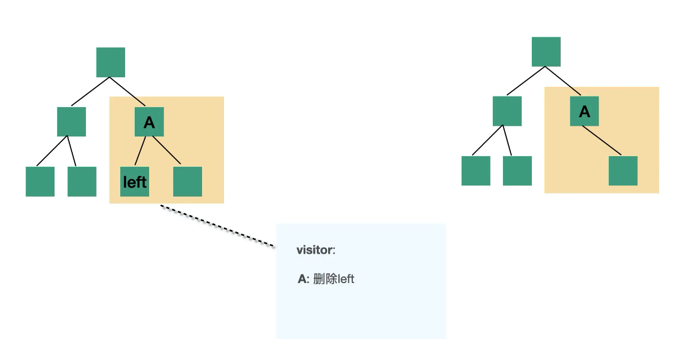

### transform

transform 阶段将 parse 阶段得到的 AST 进行转换，此时会遍历 AST，然后通过 visitor 对 AST 进行修改，返回新的 AST。



babel 将遍历的过程封装成了 @babel/traverse 库，专门用于遍历 AST。比如：
```js
import { parse } from '@babel/parser'
import traverse from '@babel/traverse'

const source = 'const a = 1'
const ast = parse(source)

traverse(ast, {
  enter(path, state) {
    if (path.node.type === 'VariableDeclaration')
      path.node.kind = 'var'
  },
})
```

在遍历的过程中，参数 path 中记录着节点相关的信息：

```js
path {
    // 属性：
    node // 节点
    parent // 父节点
    parentPath // 父 path
    scope // 作用域
    hub
    container
    key
    listKey
    
    // 方法
    get(key) 
    set(key, node)
    inList()
    getSibling(key) 
    getNextSibling()
    getPrevSibling()
    getAllPrevSiblings()
    getAllNextSiblings()
    isXxx(opts)
    assertXxx(opts)
    find(callback)
    findParent(callback)
    
    insertBefore(nodes)
    insertAfter(nodes)
    replaceWith(replacement)
    replaceWithMultiple(nodes)
    replaceWithSourceString(replacement)
    remove()
    
    traverse(visitor, state)
    skip()
    stop()
}
```

通过 path ，我们可以很轻松的获取 AST 上的节点信息，并且对节点进行增删改操作。此外，babel 还提供了另外两个库用于处理 AST:

- @babel/types：包含校验 AST 节点类型的一些方法。
- @babel/template：path 虽然能修改 ast，但是对于想创建复杂的 ast 来说比较麻烦，因此提供了 template 来根据模板字符串来快速创建 ast。


## plugin/preset

### plugin

babel 提供了插件机制允许我们修改 AST。插件一般存在两种形式：函数形式和对象形式，函数形式返回的也是对象，这里组要以函数形式为例：

```js
export default function(api, options, dirname) {
  return {
    inherits: parentPlugin,
    manipulateOptions(options, parserOptions) {},
    pre(file) {},
    visitor: {},
    post(file) {}
  };
} 
```

其中 visitor 就是遍历 AST 时，对 AST 节点的访问，在这里可以做一些节点的修改。比如以 const 转换为 var 为例：
```js
// 插件
module.exports = (_api) => {
  return {
    visitor: {
      VariableDeclaration(path) {
        if (path.node.kind === 'const')
          path.node.kind = 'var'
      },
    },
  }
}

// 源码
const a = 1;
// 生成代码
var a = 1;
```

再以组件库的按需加载为例：

```js
// 插件
const template = require('@babel/template')
module.exports = (_api, _options, _dirname) => {
  return {
    visitor: {
      Program: {
        enter: (path) => {
          path.traverse({
            ImportDeclaration(path) {
              const libPath = path.get('source').node.value
              if (libPath === '@qt/design') {
                const specifiers = path.get('specifiers')
                const importDeclarations = specifiers.map((specifier) => {
                  const specifierName = specifier.node.local.name
                  const importDeclaration = template.default.ast(`
                    import ${specifierName} from '${libPath}/lib/${specifierName}';
                    import '${libPath}/lib/${specifierName}.css';
                  `)

                  return importDeclaration
                })
                path.replaceWithMultiple(importDeclarations.flat())
              }
            },
          })
        },
      },
    },
  }
}

// 源码
import { Button, Icon } from '@qt/design'
// 生成的代码
import Button from '@qt/design/lib/Button';
import '@qt/design/lib/Button.css';
import Icon from '@qt/design/lib/Icon';
import '@qt/design/lib/Icon.css';
```

通过上面两个例子可以看出 babel 可以通过插件，对代码进行各种各样的转换，因此我们需要使用新语法时只需要增加新语法的转换插件即可，比如装饰器babel/plugin-proposal-decorators，可选链@babel/plugin-proposal-optional-chaining 等等。

### preset

plugin 是单个转换功能的实现，当 plugin 比较多或者 plugin 的 options 比较多的时候就会导致使用成本升高。这时候可以封装成一个 preset，用户可以通过 preset 来批量引入 plugin 并进行一些配置。preset 就是对插件的一层封装，其中最常见的就是 @babel/preset-env 包含了一系列的语法转换插件，用户只需要指定相应的浏览器环境，它就提供相对应的语法转换插件。

preset 和 plugin 从形式上差不多，但是应用顺序不同。 babel 会按照如下顺序处理插件和 preset： 

1. 先执行 plugin，再执行 preset
2.  plugin 从前到后，preset 从后到前

