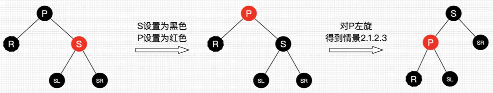
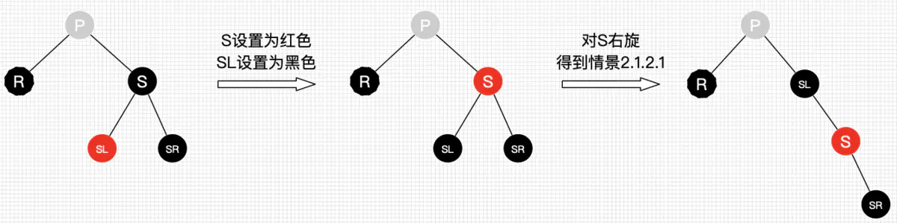
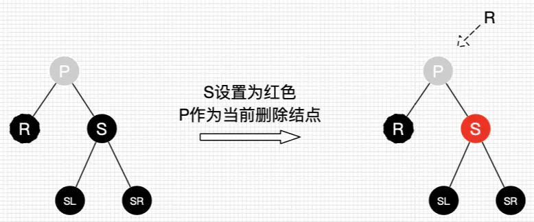

# 红黑树

## 红黑树 vs AVL树

AVL是严格的平衡二叉树，无论是执行插入还是删除只要不满足要求都会进行旋转，而旋转时非常耗时的，所以AVL树更适合插入和删除比较少但查找多的情况。红黑树是一种弱平衡二叉树，他的旋转次数较AVL少许多，因此应用场景也相对广一些。

## 性质

1. 每个结点都是红色的或是黑色的
2. 根结点是黑色的
3. 每个叶结点是黑色的
4. 如果一个结点是红色的，则它的两个子结点都是黑色的
5. 对于每个结点，从该结点到其所有后代叶结点的简单路径上，均包含相同数目的黑色节点

## 插入

1. 如果父结点为黑色结点，那么插入的红色结点不会影响平衡，跳过。
2. 如果父结点为红色结点
   1. 如果叔结点为红色结点
      1. 父结点和叔结点变为黑色，祖父结点如果不是根结点则变红色
      2. 向上递归，继续平衡祖父结点
   2. 如果叔结点不存在或是黑色结点
      1. 先进行旋转（同 AVL 树4种旋转方式）
      2. 父结点和祖父节点换颜色
      3. 向上递归，继续平衡祖父结点

## 删除

1. 找到**替换结点**：左子树的最大值结点 or 右子树的最小值结点（类似于二叉查找树的删除结点）
2. **情景1**：如果替换结点是红色，那么直接将替换节点值赋给删除结点，并删除替换结点。
3. 如果替换结点是黑色：
   1. **情景2**：如果替换结点是其父结点的左结点
      1. **情景2.1**：如果替换结点的兄弟结点是红色，删除黑结点会导致左侧黑色结点少一，此时通过交换兄弟结点和父结点颜色并向左旋转解决。（类似于右右的结点情况）
      2. **情景2.2**：如果替换结点的兄弟结点是黑色，兄弟结点右结点为红色，左结点为任意颜色，此时不能通过情景2.1那样左旋达到平衡，而是需要将红色右子结点”借“过来。兄弟结点和父结点颜色对调，右子结点变为黑色，并进行左旋。
      3. **情景2.3**：兄弟结点右结点为黑色，左结点为红色。此时左结点与兄弟结点交换颜色，并右旋。再进行情景2.2
      4. **情景2.4**：兄弟结点子结点均为黑色。此时兄弟结点没有结点可以借了，只能向父结点借，把兄弟结点设为红色，将父结点作为新的替代结点，自底向上处理。 
   2. **情景3**：如果替换结点是其父结点的右结点，与左节点情况镜像

## 参考
- [红黑树图示](https://segmentfault.com/a/1190000014037447)
- [算法导论-红黑树](https://github.com/mymmsc/books/blob/master/算法导论中文版.pdf)
- [30张图带你彻底理解红黑树](https://www.jianshu.com/p/e136ec79235c)
- [红黑树与AVL对比](https://blog.csdn.net/u010899985/article/details/80981053)
- [oi-wiki](https://oi-wiki.org/ds/llrbt/)
- [红黑树删除](https://segmentfault.com/a/1190000022278733)
- [红黑树可视化过程](https://www.cs.usfca.edu/~galles/visualization/RedBlack.html)