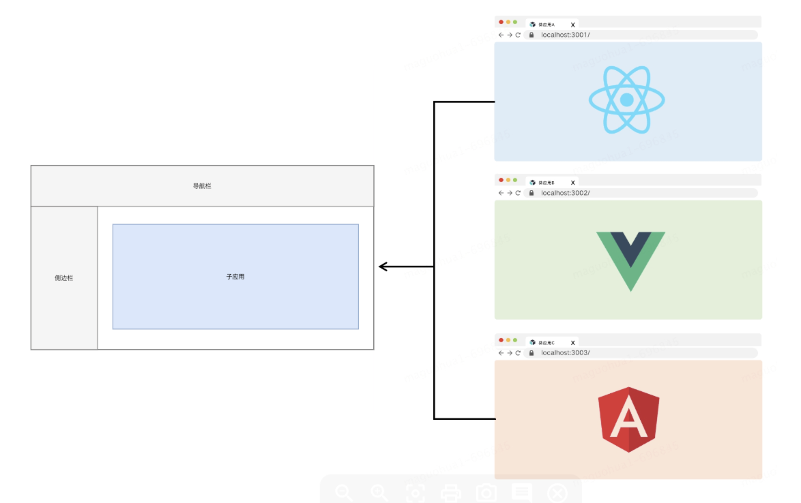
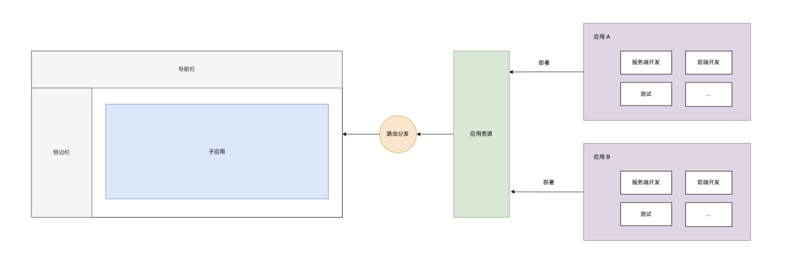
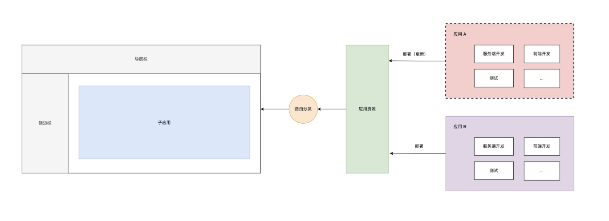
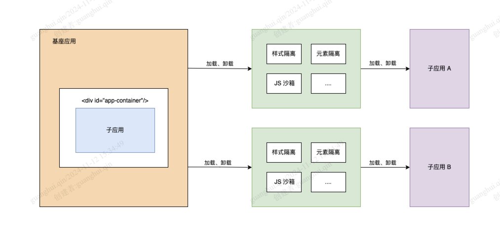

# 微前端的优势

## 技术栈无关

主框架不限制接入应用的技术栈，微应用具备完全自主权。

## 独立开发、独立部署

子应用仓库独立，前后端可独立开发，部署完成后主框架自动完成同步更新。

## 增量升级

在面对各种复杂场景时，我们通常很难对一个已经存在的系统做全量的技术栈升级或重构，而微前端是一种非常好的实施渐进式重构的手段和策略。

## 独立运行时

每个子应用之间状态和样式隔离，运行时状态不共享。

