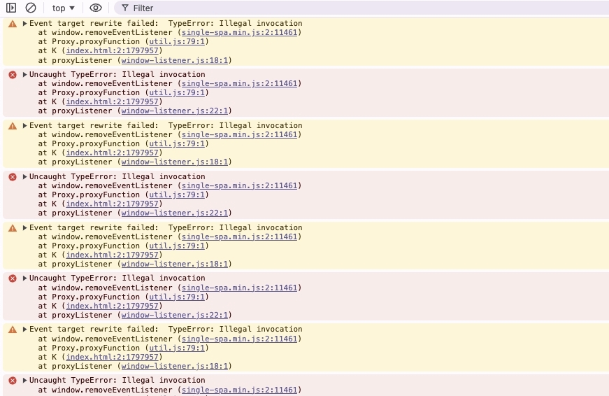
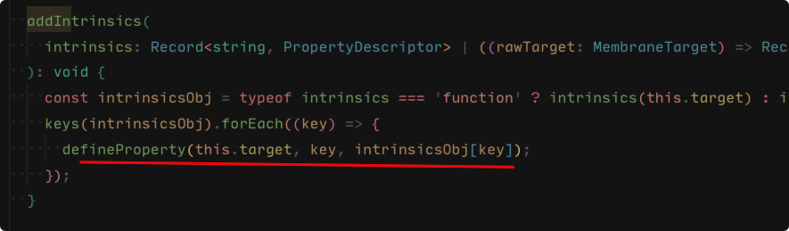
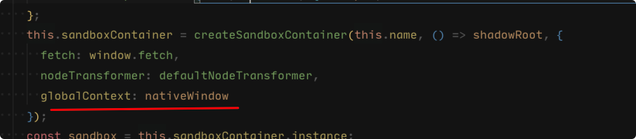

# App 嵌套运行报错

## 问题背景

当前项目架构采用的是 `Platform + Multiple Apps` 的方式，在 `App` 平铺的情况下是正常运行的。但是业务又想要在一个 `App` 中通过微前端加载另一个 `App`。这就产生了 `App` "嵌套" 的问题，最终运行时报错“非法调用”：

## 问题原因

当 `App` 嵌套时，`window` 的创建方式也是嵌套的，例如 `A > B > C` 的嵌套结构。

`A` 为原始 `window`，`B` 为基于原始 `window` 的 `proxyWindow`，`C` 为基于 `B` 的 `proxyWindow` 的 `proxyWindow`。

这就导致一个问题：`B window` 上设置的值，会被 `C` "继承"。在 `qiankun` 中，`C` 会通过 `defineProperty` 设置 `B window` 上的该属性：

但是 `C` 中定义完该属性后，就没法再次通过 `defineProperty` 设置值了，导致 `can not redefined`。

另外，`qiankun` 中对 `window` 上的方法还会进行 `rebindTarget2Fn` 包装，包装多次后导致非法调用。

## 解决方案

将 `App` `window` "拍平"，让他们都以同一个基准 `window` 来创建。`qiankun` 正好也提供给了该方法：

window 拍平之后，就没有嵌套产生的各种问题了，并且 window 间都是相互独立的。
