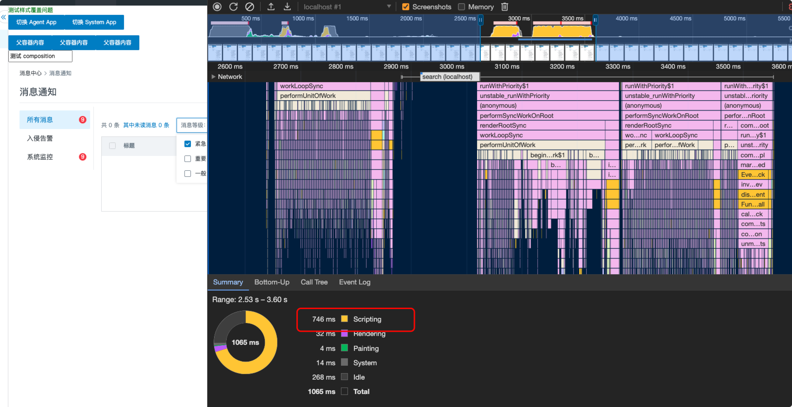
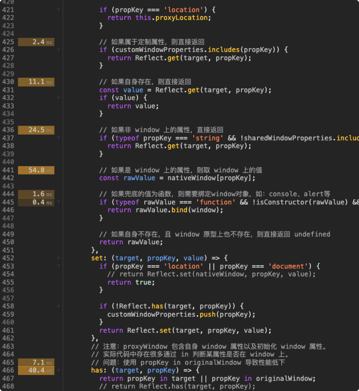
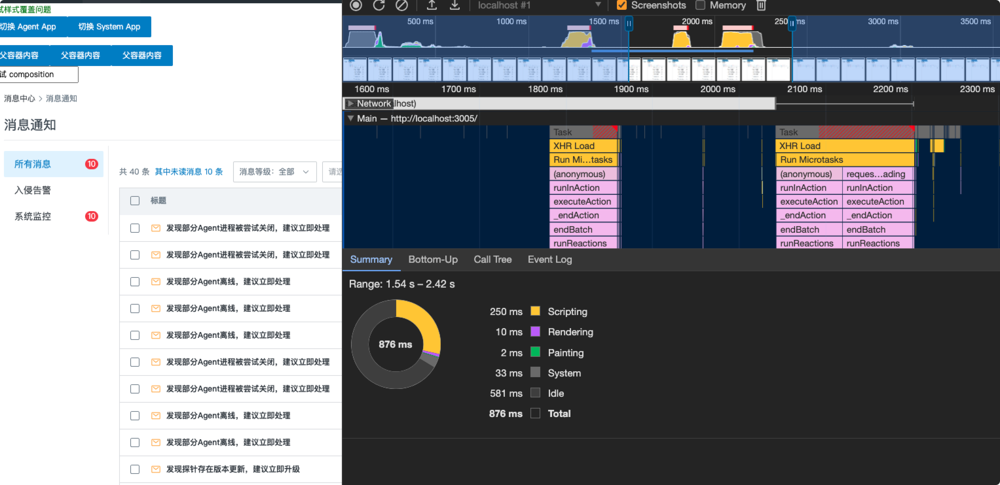
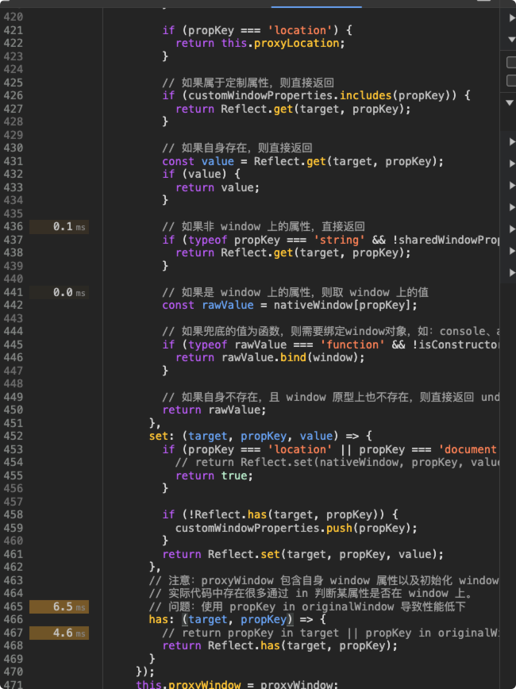
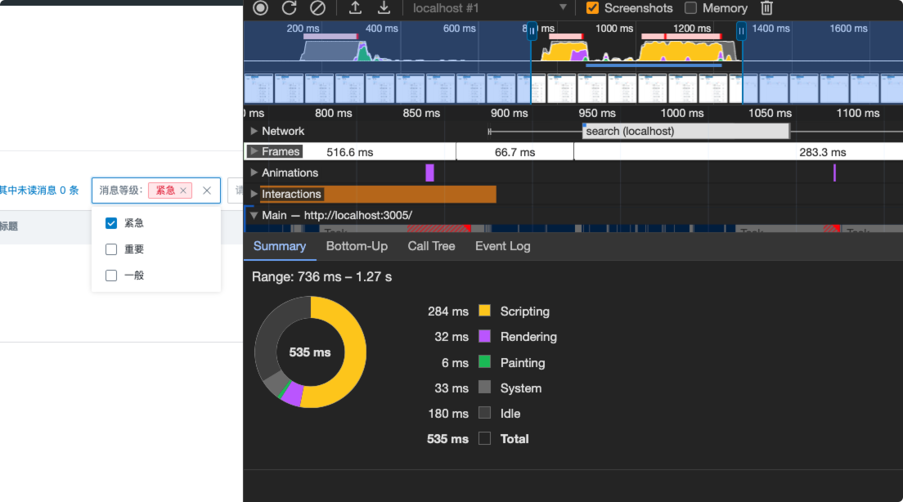
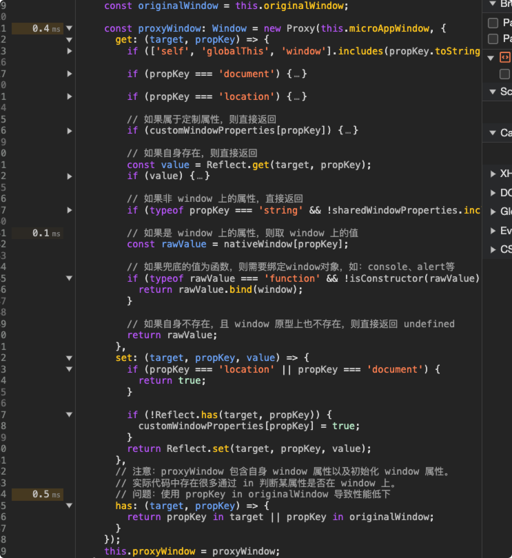
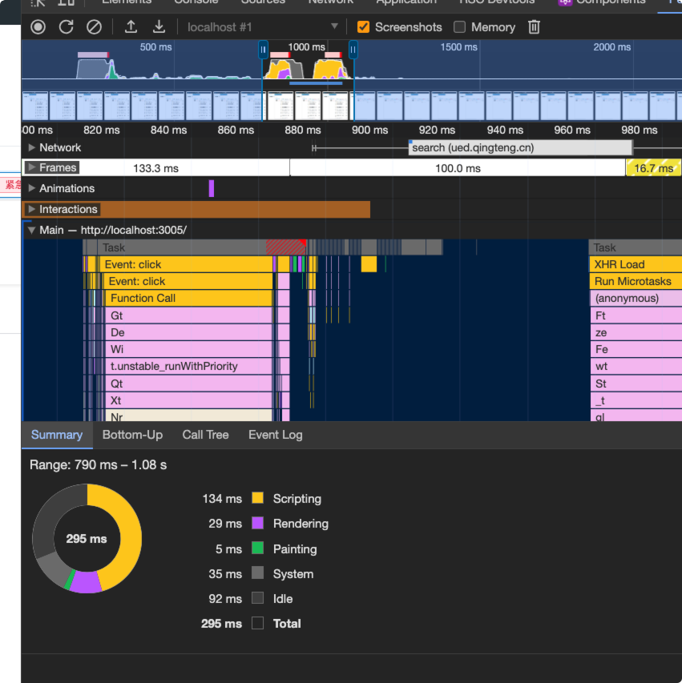

# 开发环境下卡顿问题

## 问题描述

`new Proxy` 中 `has` 中设置 `key in window` 时，`script` 执行慢：

未设置 `key in window` 时：

这种情况主要出现在开发环境，即 `system app` 是本地环境的情况。推测原因可能是开发环境下使用 `window` 上的内容较少，生成环境下将一些无用的代码都抹除掉了。

## 优化

- 对 `window` 上常用的构造函数进行缓存，让 `get` 少执行
- 对构造函数的判断进行优化，让正则判断优先于原型判断
- 对事件监听的内容进行优化，用 `map/set` 结构代替数组结构。

### 开发环境下

### 线上环境

## 解决方案

通过监控发现，`proxy` 中 `get` 和 `has` 耗时较高，因此对这块代码进行优化：（tip: `performace` 中可以查看源码的具体执行时间，非常方便能看到哪些代码是比较耗时的。）

- 对代理 `window` 的一些全局变量进行缓存，使其尽量少的调用 `get` 方法
- 对 `get` 方法的逻辑进行优化，减少复杂度。
- 对 `listener` 代理的逻辑进行优化，减少复杂度
