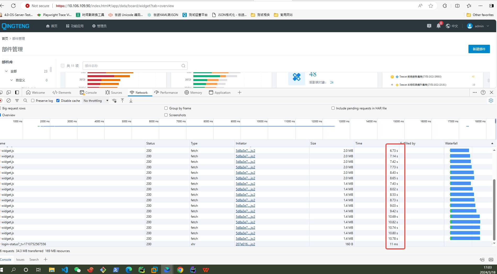

# 多个 `widget` 同时加载时卡顿

## 问题描述

在看板页面中，存在多个 `widget`，每个 `widget` 内部都会去请求 `widget.js` 文件，导致请求数过多，一次性会加载几十 MB 的内容，从而导致页面加载缓慢。



## 解决方案

实际上，这些 `widget` 大部分请求都是重复的，只是加载回来使用的组件不同而已。

因此，可以对 `widget` 的请求进行去重处理。对于相同 `widget url` 的请求，下一次的请求不会继续发送，而是使用上一次的请求结果。

``` ts
const codeCache: Record<string, Promise<string> | undefined> = {};

let code = '';
if (!!codeCache[url]) {
  code = (await codeCache[url]) as string;
} else {
  const promise = nativeWindow.fetch(url).then((res) => res.text());
  codeCache[url] = promise;
  code = (await promise.catch((e) => {
    console.error('Widget 加载失败', e);
    codeCache[url] = undefined;
  })) as string;
}
```

请求缓存后，会发现看板页面不再有重复的 `widget` 请求，加载速度有所提升。

但是这样又导致另外一个问题：由于多个 `widget` 采用同一个请求回来的结果，多个 `widget` 同时采用微前端的方式进行创建 `window/document` 然后执行 `js` 时，会导致加载页面卡顿。

这是因为多个 `widget js` 是以同步的形式执行，加起来比较耗时，从而导致页面卡顿。

解决方式是，将 `widget js` 的执行放到异步环境中去执行，比如 `setTimeout/requestIdleCallback` 等，让 `js` 的执行在合适的时机执行，避免影响用户的交互行为。
