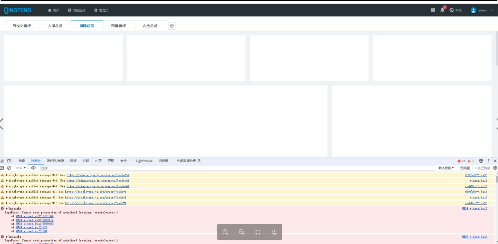
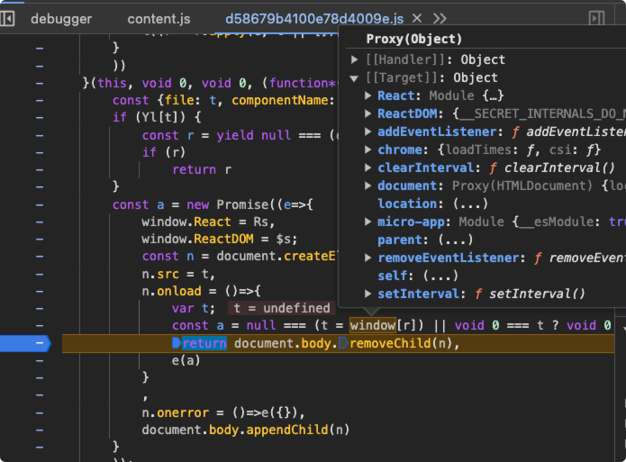

# widget 偶现白屏问题

## 问题描述

看板首页在切换的时候偶尔会出现白屏现象，并且刷新后立马就好了。

## 问题原因

经排查，出现白屏后，每次切换到该 `widget` 的时候，还是会正常走请求+渲染的流程，但是拿到的 `component` 为 `undefined`。表明之前存储的 `component` 为 `undefined`，并且后续也没有进行请求新的 `widget`。

但是代码里 `script` 标签加载后，即使是错误，也会抛出 `{}` 空对象，而不是 `undefined`。

猜测可能是异步问题导致白屏现象。所以每次切换到 `widget` 前，将网络切换到 `slow 3G`，然后切换到其他 `app` ，进行等待。过一段时间，等 `widget` 加载完成后，发现两个异常现象：

- 取到的 `widget` 为 `undefined`。
- `document.body.removeChild` 报错。

而这两个问题导致的原因是，切换到其他 `app` 时，上一个环境会对内存进行释放，会做一些操作。

- `sandbox` 的 `window` 会被锁住，那么 `script` 异步加载将 `widget` 挂载到  `window` 上的操作是无效的，因此拿到的 `window.widget` 为 `undefined`。
- `sandbox` 的 `document` 会被释放内存，因此此时 `removeChild` 实际上是原生的 `removeChild` 方法。但是由于 `script` 标签并非在 `App` 内部挂载的，而是为了使 `currentScript` 生效，挂载到全局，因此实际上 `script` 并不在 `App` 内部，导致 `removeChild` 报错。

## 解决方案

- 取 `window.widget` 的时候，需要判断是否为 `undefined`，而不采用之前的 `{}` 空对象形式。
- `document removeChild` 重置时，对 `removeChild` 进行包裹，用于判断移除的节点是否在父节点内部，确保移除方法不报错。
