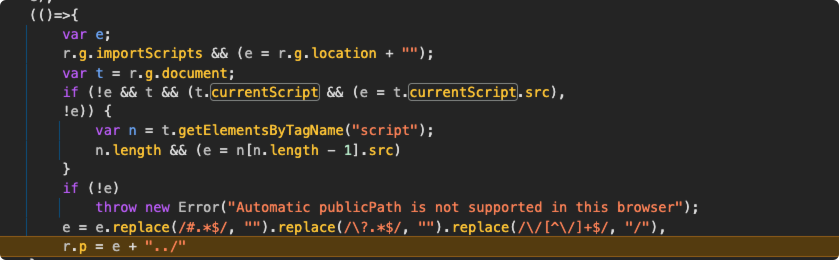

# 图片路径问题

## 问题背景

`XDR App` 中通过 `require()` 方法引入图片，但是在 `Platform` 加载 `XDR App` 后，发现 `XDR App` 中图片的引入路径错误，是相对于 `Platform` 的引入路径。

## 问题原因

通过断点发现，`webpack` 中设置 `publicPath auto` 的时候，`publicPath` 的相对路径是根据 `script` 标签的路径来的。

- 判断是否是 `importScripts`，如果是的话，那么相对于 `window.location`
- 判断是否有 `currentScript`，如果 `currentScript` 存在，那么当前执行的 js 的相对路径是相对于 `currentScript.src`
- 如果没有 `currentScript`，那么相对路径降级为 `script` 标签的 `src`

在现有的微前端中：

- 由于 `script` 通过 `eval` 执行，因此 `currentScript` 一直为空。
- 由于获取的 `scripts` 通过 `script` 执行，`dom` 中不存在 `scripts`，因此将其代理到了根应用的 `scripts`，导致最终取得的 `src` 是相对于根应用的路径。

## 解决方案

- 代理 `currentScript`: `eval` 执行前指向当前 `script`，执行完后，将 `currentScript` 置为 `null`。
- 代理 `scripts`: `eval` 执行时记录当前 `script` 节点，访问 `document.scripts` 时返回当前应用的 `scripts` 节点。
