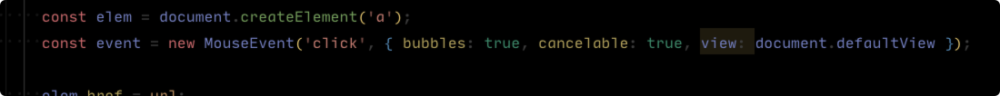

# UiEvent view 指向代理 window 报错

## 问题描述

`App` 中的 `MouseEvent` 实例化时报错：



``` ts
TypeError: Failed to construct 'MouseEvent': Failed to read the 'view' property from 'UIEventInit': Failed to convert value to 'Window'.
```

## 问题原因

当实例化 `MouseEvent` 的时候，`view` 指向的是 `proxyWindow`，`UiEvent` 无法将其转换为 `Window`。

## 解决方案

看了 `qiankun` 相关的 `issue`，也存在相应的问题。`qiankun` 是通过一个代理覆写了 `MouseEvent` 方法，但是后来又导致了其他的鼠标事件问题。并且这种覆写只能解决 `MouseEvent` 的事件问题，其他的事件可能也存在这种问题。

后来，`qiankun` 将相应的代码移除了，让用户自己去处理这个问题，比如这里使用 `elem.click()` 方法代替使用 `new MouseEvent()`。

所以微前端暂不处理这块的问题，由项目自行解决。

## 参考

- [https://github.com/umijs/qiankun/pull/885](https://github.com/umijs/qiankun/pull/885)
- [https://github.com/umijs/qiankun/pull/573/files/0a05e7f0981d2790a1b21a69a2d02b3709151ff3](https://github.com/umijs/qiankun/pull/573/files/0a05e7f0981d2790a1b21a69a2d02b3709151ff3)
