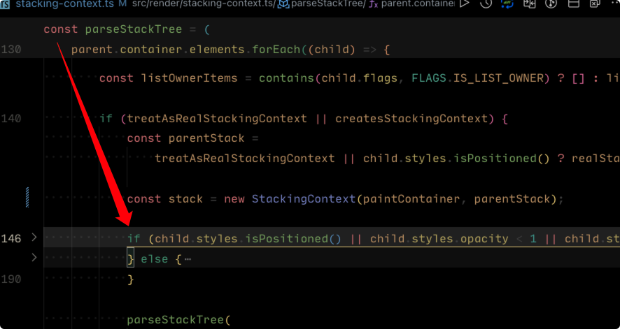
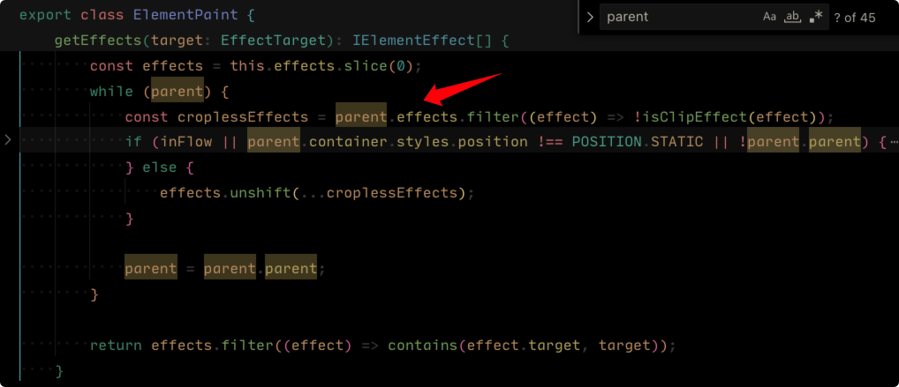

# 截屏时 `position: fixed` 层级低于 `sidebar/topbar` 问题

## 问题描述

`html2canvas` 截屏时，如果 `position: fixed` 的元素的父元素有 `position: relative`，就会导致截屏时，`fixed` 在 `relative` 后绘制，导致最终的绘制层级错误。

## 问题原因

此 `bug` 属于 `html2canvas` 的 `bug`，之前一直没出现是因为 `drawer` 是挂到 `body` 的。但是 `5.0` 中 `app` 使用 `shadowDOM` 后，`drawer` 挂载 `app` 内部，如果父元素中存在 `position: relative`，就会产生问题。

## 解决方案

`html2canvas` 已经2年未维护，基本不会再更新，所以只能修改其源码解决。

主要修改 `canvas/staking-context.ts` 文件，粗略的解决思路是：

1. 当 `postition` 为 `fixed` 的时候，找到根节点或者是找到 `transform: xxx` 的目标元素，将当前 `stack` 加入到目标元素中（因为 `position: fixed` 是相对于目标元素进行定位的）。

2. 绘制的时候，`position: fixed` 会被上层的 `overflow: hidden` 影响。所以还需要剔除 `position: fixed` 元素到 目标元素间 其他元素的 `overflow: hidden` 的影响。

