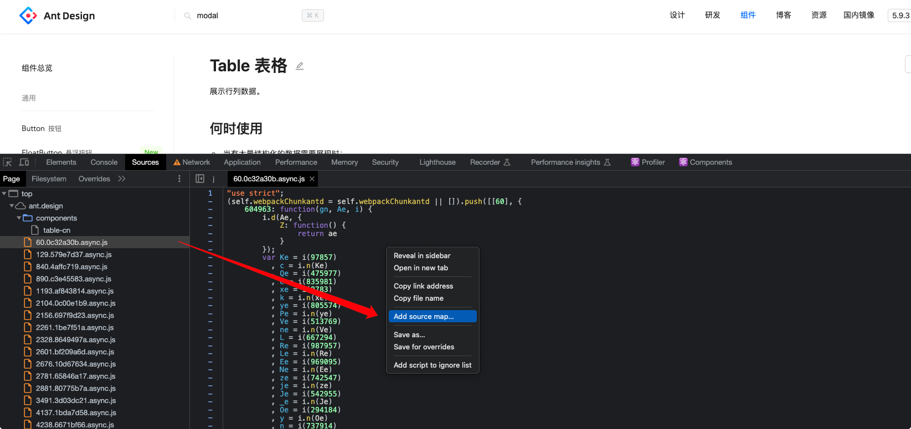

# Sourcemap 调试

## 背景

公司 4.0 项目中采用联邦模块的方式来是组织其他 `App` 项目，并且引入了 `Widget` 动态组件的概念。这种架构方式使得 `App/Widget` 能够独立开发，提高了可维护性和可扩展性，但同时也使得 `App/Widget` 之间的调试变得复杂。比如在 `App` 开发中发现 `Widget` 存在问题时，需要启动 `Widget` 项目，并且修改 `App` 中 `Widget` 的引用方式来调试，比较复杂。

## 问题原因

之所以存在上述问题，是因为在生成环境下通常不会生成 `sourcemap` 文件。因为 `sourcemap` 文件中包含了源码的信息，如果泄露出去，可能会产生一些安全问题。另外一方面加载 `sourcemap` 文件会增加网络请求，影响性能。

由于没有 `sourcemap` 文件，浏览器无法将编译后的代码映射到源码，因此无法在浏览器中调试源码。

## 浏览器加载 Sourcemap

浏览器加载 `sourcemap` 主要通过三种方式：

### sourceMappingURL 注释

在构建产物时，如果我们选择生成 `sourcemap` 文件，那么在生成的文件结尾都会有一个 `sourceMappingURL` 注释：

```js
// # sourceMappingURL=button.js.map
```

每次加载该文件时，浏览器会根据 `sourceMappingURL` 注释中的 `URL` 路径来加载相应的 `sourcemap` 文件。

::: tip
通过 `//# sourcemapURL` 可以直接指定源码地址。
:::

### HTTP 响应头 SourceMap

在文件加载时，浏览器会根据 `HTTP` 响应头 `SourceMap` 来加载 `sourcemap` 文件。

### Add source map

在浏览器中，我们还可以通过手动关联 `sourcemap` 文件。比如在 `Sources` 面板中对 `js` 文件进行手动关联：


关联后，我们就可以在 `Sources` 面板中调试源码了。

## 解决方法

## Sourcemap 原理

## 参考

- [SourceMap](https://developer.mozilla.org/en-US/docs/Web/HTTP/Headers/SourceMap)
- [Developer Resources: View and manually load source maps](https://developer.chrome.com/docs/devtools/developer-resources/)
- [彻底搞懂 Webpack 的 sourcemap 配置原理](https://juejin.cn/post/7136049758837145630)
