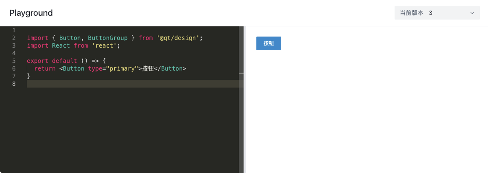

# 组件 Playground

## 背景

目前公司内部组件库文档都是生成的静态组件示例，对于未在文档上说明的一些 `Api` 属性，开发者需要手动去调试才能知道其用途，但是这种调试过程十分麻烦，效率比较低。

因此，计划开发一个组件库 `Playground`。目的一是为了提高开发者调试组件的效率，二是方便开发者复现问题，便于处理组件库 `bug`。

## 实现思路

以 `Button` 示例代码为例：

```tsx
import { Button } from '@qt/design'
import React from 'react'

export default () => {
  return <Button type="primary">按钮</Button>
}
```

### 编译代码

首先对于以上代码是无法在浏览器中直接运行的，浏览器无法识别 `jsx` 语法，所以我们需要将以上示例代码进行打包。

这里就需要一个打包工具，我们使用 [sucrase](https://github.com/alangpierce/sucrase) 这个库，该库相较于 `webpack` 等打包工具，省去了需要 `不必要` 的打包过程，因此该库的体积更小，打包速度更快。

```tsx
import { transform } from 'sucrase'

const code = `
import { Button } from '@qt/design'
import React from 'react'

export default () => {
  return <Button type="primary">按钮</Button>
}
`

try {
  const compiledCode: string = transform(code, {
    transforms: ['jsx', 'typescript', 'imports']
  })?.code
}
catch (error: any) {
  console.log(error)
}
```

打包后，我们就能拿到浏览器能直接识别的低版本的 `js` 代码了：

```js
// 打包结果
'use strict'
const _jsxFileName = ''

Object.defineProperty(exports, '__esModule', { value: true })

function _interopRequireDefault(obj) { return obj && obj.__esModule ? obj : { default: obj } }

const _design = require('@qt/design')
const _react = require('react')
const _react2 = _interopRequireDefault(_react)

exports.default = class extends _react2.default.Component {
  render() {
    return (
      _react2.default.createElement(_design.Button, { type: 'primary', __self: this, __source: { fileName: _jsxFileName, lineNumber: 6 } }, '按钮')
    )
  }
}
```

这里需要注意，打包参数 `['jsx', 'typescript', 'imports']` 表示会将 `jsx/typescript/imports` 语法进行转换，`imports` 表示会将 `import` 语法转换为 `require` 语法。这里我采取的是 `commonjs` 语法，当然也可以不进行转换，在浏览器运行时通过 `importmap` 来添加依赖。

### 添加依赖

打包后的代码是一个字符串，要运行这段代码可以通过两种方式：

- 通过 `iframe` 运行
- 通过 `eval/Function` 运行

两种方案都可以，这里我们采取 `iframe + eval` 的方案，主要是希望用 `iframe` 来能够隔离运行环境，避免污染全局变量，而 `eval` 可以在编译代码改变时来执行 `编译的代码`。

但是这段代码还不能直接运行，因为代码里引入了外部依赖：`@qt/design` 和 `React`，所以我们需要在 `iframe` 里添加相应的依赖。如：

```html
<script crossorigin src="http://ued.qingteng.cn:37022/library/lodash.umd.js"></script>
<script crossorigin src="http://ued.qingteng.cn:37022/library/react18.dev.umd.js"></script>
<script crossorigin src="http://ued.qingteng.cn:37022/library/react-dom18.dev.umd.js"></script>
```

这里添加的依赖是 `umd` 格式，因此我们可以直接通过 `window` 来获取到相应的依赖，如：

```js
const __modules__ = {
  'react': window.React,
  'react-dom': window.ReactDOM,
  '@qt/design': window.QtDesign
}
```

### 运行代码

接下来就是运行代码了，这里我们通过 `eval` 来运行代码，如下：

```js
try {
  const req = name => __modules__[name]
  const Component = eval(`
    (function (require, exports) {
      ${compiledCode}
      return exports.default;
    })(${req}, {});
  `)
}
catch (e) {
  // ...
}
```

这样我们就能拿到运行的 `React` 组件 `Component` 了。

### 挂载组件

拿到组件后，我们只需要通过 `ReactDOM` 将组件挂到 `root` 节点上即可。

```js
const { React, ReactDOM } = window
// 1. 使用 window 上挂载的 ReactDOM
// 2. Component 通过 createElement 实例化，因为浏览器不识别 jsx
const root = ReactDOM.createRoot(document.getElementById('root'))
root.render(React.createElement(Component, null, {}))
```

以上我们就实现了最基本的 `React` 组件运行的能力了，接下来进行完善 `Playground`。

### 添加编辑器

为了方便开发者编辑代码，我们需要添加一个编辑器，这里我们使用 `monaco-editor`，该编辑器支持 `typescript` 语法高亮，以及 `typescript` 代码提示，非常适合我们的场景。

当编辑器内容 `onChange` 时，进行代码编译，并将编译后的代码通过 `iframeRef.current?.contentWindow?.postMessage({ compiledCode })` 发送给 `iframe`，`iframe` 收到消息后，通过 `eval` 运行代码。通过 `root.render` 更新视图。

### 错误处理

当代码编译出错或者运行出错时，我们需要将错误信息展示给用户，此时可以通过 `React ErrorBoundary` 来捕捉错误：

``` tsx
class CodeErrorBoundary extends React.Component {
  state = {
    error: null
  }

  static getDerivedStateFromError(error) {
    return { error }
  }

  render() {
    const { children } = this.props
    const { error } = this.state
    return error ? createErrorComponent(error) : children
  }
}

// 将根节点用 error boundary 包裹
const root = ReactDOM.createRoot(document.getElementById('root'))
root.render(React.createElement(CodeErrorBoundary, null, React.createElement(Component)))
```

但 `React` 运行报错时，`CodeErrorBoundary` 会捕捉错误并呈现到 `UI` 上。

### 动态依赖

可以通过弹窗的形式来添加依赖，添加完的依赖会在 `iframe` 中以 `script` 的形式加载。当然也可以支持动态切换组件库的版本。

### 链接分享

当开发者复现 `bug` 时需要将 `bug` 场景分享给开发者，此时 `url` 中应包含 代码信息、组件库版本信息等。

我们可以通过 `fflate` 库将 { code, version } 等信息进行压缩，然后通过 replaceState 将压缩后的信息添加到 `url` 中。打开分享链接的时候从 `url` 中获取压缩信息，然后解压，获取到 { code, version } 等信息，然后回传仅组件。具体实现可以参考 [vuejs/repl](https://github.com/vuejs/repl)。

:::tip
`fflate` 通过哈夫曼算法进行压缩，对于出现频率较高的字符，使用更少的字节进行存储，从而达到压缩的目的。
:::

## 实现效果预览


