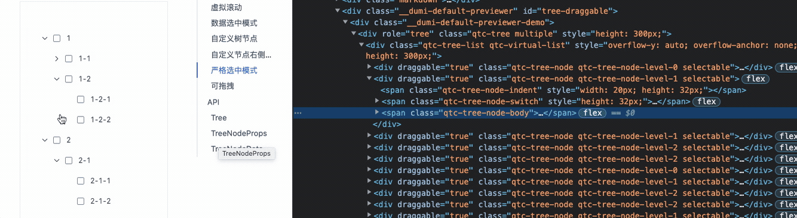

# 虚拟滚动

## 需求
组件库里的`tree`和`select`等组件由于展示的数据量过大，导致界面卡顿，需要通过虚拟滚动来解决这个问题，并且需要支持行高度非等高的情况。

## 思路
### 实际渲染内容计算
首次渲染时，由于不知道每一行的高度，此时可以通过给定一个最小高度 `minItemHeight` 来计算需要渲染的内容。因为根据最小高度计算出来的结果最终渲染出来的内容高度肯定是大于视口高度的。如：
``` ts
// 应该渲染的数目
const count = viewportHeight / minItemHeight

// 实际渲染的高度永远是大于视口高度的
count * 每行的实际高度 > viewportHeight
```

实际的计算结果如下：
``` ts
calculateChildrenRange: () => {
  start: number; // 起始索引
  end: number; // 结束索引
  offset: number; // 内容偏移量
  scrollHeight: number; // 整体滚动高度
} = () => {
  const { data } = this.props;
  const { scrollTop } = this.state;

  if (!this.isVirtual) {
    return {
      start: 0,
      end: data.length - 1,
      offset: 0,
      scrollHeight: 0
    };
  }

  let startIndex;
  let endIndex;
  let startOffset;
  let itemTop = 0;
  for (let i = 0; i < data.length; i++) {
    const item = data[i];
    // 如果没有实际高度，就采用最小高度
    const height = this.getHeight(item);
    const itemBottomOffset = itemTop + height;

    // 计算第一个需要显示的内容
    if (itemBottomOffset >= scrollTop && startIndex === undefined) {
      startIndex = i;
      startOffset = itemTop;
    }

    // 计算最后一个需要显示的内容
    if (itemBottomOffset > scrollTop + this.props.height && endIndex === undefined) {
      endIndex = i;
    }

    itemTop = itemBottomOffset;
  }

  endIndex = Math.min((endIndex || data.length - 1) + 1, data.length);

  return {
    start: startIndex || 0,
    end: endIndex,
    offset: startOffset || 0,
    scrollHeight: itemTop
  };
};
```


### 偏移量计算
由于行高未知，那么滚动后实际渲染内容的向上偏移距离也就未知。此时可以通过记录每一行的实际高度来计算偏移量。每次内容区域渲染完成时，获取实际的高度并记录下来，这样在滚动后偏移量就能通过记录的实际高度来计算了：
``` ts
// 收集的高度
private itemHeights: Map<string | number, number> = new Map();

// 实际渲染
renderList = (start: number, end: number) => {
  const { data, renderItem = () => null } = this.props;

  return data.slice(start, end + 1).map((item, index) => {
    const originIndex = start + index;
    const node = renderItem(item, originIndex) as React.ReactElement;
    const key = this.getKey(item);
    return React.cloneElement(node, {
      key,
      // 收集 ref 并更新实际行高
      ref: (ele: React.ReactNode) => this.collectRef(item, ele)
    });
  });
};
```

## 效果


## 问题

### `tree` 组件使用虚拟滚动时，收起展开怎么实现动画效果？
由于是虚拟滚动，每次展开时会自动计算需要显示的内容数目。如果按照原有的实现，在展开收起时，更新数据，重新计算显示内容，是不会有展开收起动画的。

通过参考[rc-tree](https://github.dev/react-component/tree)，总结了一下实现动画的思路：
- 展开收起时记录展开收起的子节点数据 `rangeNodes`（用于后续做动画），上一次的渲染数据 `prevData`，这次更新的数据 `data`。
  - 其中 `rangeNodes` 需要计算最小动画的范围，因为展开的子节点有可能数据量也非常大，可以通过 `height/itemHeight` 计算应该展示动画的节点数。
- 如果是展开时，此时为新增数据：
  - 在上一次数据 `prevData` 上，找到需要展开的节点，在后面添加一个占位节点，记做 `transitionData`，用于后续渲染子节点并做动画。
  - 在渲染时，通过 `transitionData` 来渲染，当遇到占位节点时，用 `rangeNodes` 渲染需要展开的内容。这个时候可以通过 [rc-motion](https://github.dev/react-component/motion/blob/master/src/CSSMotion.tsx) 来实现展开动画。
  - `rc-motion` 展开动画结束后，产生 `onAppearEnd` 回调，在回调里将 `transitionData` 设置为 `data` 用最新的数据重新渲染。
- 如果是收起，此时为删减数据：
  - 此时逻辑与展开时大体一致，通过最新数据 `data` 添加占位节点，实现收起动画，收起完毕后，刷新数据。

因此，整体的思路大致是：在直接更新数据前，会计算需要展开收起的数据，用这些数据做动画，做完了动画将数据更新重新渲染（相当于做动画渲染的节点动画完成后会被移除，用最新的数据替代）。

代码实现时，需要分为几个阶段，也对应着几次更新：

- `done` 阶段：为初始状态，表示无动画或者动画完成。当数据更新时，会计算变更的数据。如果是展开，会进入到 `show` 阶段。如果是收起，会进入到 `prepareHide` 阶段。
- `show` 阶段：根据计算的动画数据，做展开动画。动画结束后，回到 `done` 阶段。
- `prepareHide` 阶段：准备收起的阶段。由于 `rc-motion` 渲染节点时，需要 `visible` 从 `true` 到 `false` 的一个转变才能做动画，即先展开后隐藏。展开时不需要动画效果。展开完成后通过 `onAppearEnd` 进入到 `hide` 阶段。
- `hide` 阶段：将 `visible` 置为 `false`，动画完成后回到 `done` 阶段。 

实现效果：


核心逻辑实现：
```ts
updateTransitionData() {
  const { status, data, prevData, expandInfo } = this.state;
  if (status === 'prepareHide') {
    this.setState({ visible: false, status: 'hide' });
    return;
  }

  if (status !== 'done') {
    return;
  }

  const { expandStatus, key, list } = expandInfo;
  if (data === prevData) {
    return;
  }

  if (!this.isExpandInfoChange()) {
    this.setState({ prevData: data, transitionData: data });
    return;
  }

  this.setState({ status: 'prepare' });

  // 占位节点
  const placeholderNode: TreeNodeData = {
    label: '',
    value: PLACEHOLDER_NODE_KEY,
  };

  const targetIndex = prevData.findIndex(({ value }) => value === key);
  // 计算最小动画数据
  const rangeNodes = this.getMinimumRangeTransitionRange(list);
  // 展开
  if (expandStatus) {
    const transitionData = prevData.slice();
    transitionData.splice(targetIndex + 1, 0, placeholderNode);
    this.setState({
      transitionData,
      transitionRange: [...rangeNodes],
      transitionType: 'show',
      status: 'show',
      visible: true
    });
  } else {
    // 收起
    const transitionData = data.slice();
    transitionData.splice(targetIndex + 1, 0, placeholderNode);
    this.setState({
      transitionData,
      transitionRange: [...rangeNodes],
      transitionType: 'hide',
      status: 'prepareHide',
      visible: true
    });
  }
}

componentDidUpdate() {
  this.updateTransitionData();
}

handleMotionEnd = () => {
  const { data, expandInfo } = this.state;
  // 动画结束后，更新到最新数据
  this.setState({
    prevData: data,
    prevExpandInfo: expandInfo,
    transitionData: data,
    transitionRange: [],
    transitionType: null,
    status: 'done'
  });
};

// 渲染动画节点
renderMotionTreeNode = (node: TreeNodeData) => {
  const { transitionType, transitionRange } = this.state;

  // 如果是占位节点，做动画效果
  if (node.value === PLACEHOLDER_NODE_KEY) {
    const getCollapsedHeight = () => {
      return { height: 0 };
    };
    const getRealHeight = (dom: HTMLElement) => {
      const { scrollHeight } = dom;
      return { height: scrollHeight };
    };
    const getCurrentHeight = (dom: HTMLElement) => {
      return { height: dom.offsetHeight };
    };

    const motion = {
      onAppearStart: getCollapsedHeight,
      onEnterStart: getCollapsedHeight,
      onAppearActive: getRealHeight,
      onEnterActive: getRealHeight,
      onLeaveStart: getCurrentHeight,
      onLeaveActive: getCollapsedHeight,
      motionDeadline: 500
    };

    return (
      <CSSMotion
        {...motion}
        key={node.value}
        motionName={`${this.styleName}-node-motion`}
        onAppearEnd={this.handleMotionEnd}
        onLeaveEnd={this.handleMotionEnd}
        visible={this.state.visible}
        motionAppear={transitionType === 'show'}
      >
        {({ className: motionClassName, style: motionStyle }, motionRef) => {
          return (
            <div
              ref={motionRef}
              className={classNames(motionClassName, `${this.styleName}-transition-block`)}
              style={motionStyle}
            >
              {transitionRange.map(this.renderTreeNode)}
            </div>
          );
        }}
      </CSSMotion>
    );
  }

  return this.renderTreeNode(node);
};

```


### 滚动到某一行


## 其他
- [CSS overflow-anchor属性与滚动锚定](https://www.zhangxinxu.com/wordpress/2020/08/css-overflow-anchor/)


