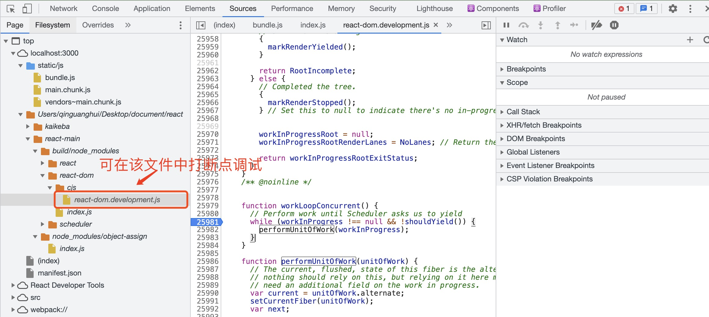

# react源码调试

### 1.拉取`react`源码：

```shell
git clone https://github.com/facebook/react.git
```

### 2.安装依赖

```shell
# 切入到react源码所在文件夹
cd react-main

# 安装依赖
yarn
```

### 3.打包`react`、`scheduler`、`react-dom`三个包为`dev`环境可以使用的`cjs`包。

```shell
# 执行打包命令
yarn build react/index,react/jsx,react-dom/index,scheduler --type=NODE
```

### 4.为`react`和`react-dom`创建`yarn link`

```shell
cd build/node_modules/react
# 申明react指向
yarn link

cd build/node_modules/react-dom
# 申明react-dom指向
yarn link
```

如果之前`link`过`react`包，可在`~/.config/yarn/link`文件中进行删除后再`link`。

### 5.创建一个`react`项目

```shell
npx create-react-app react-demo
```

### 6.引入刚刚`yarn link`的包

```shell
yarn link react react-dom
```

### 7.运行`react`项目

```shell
yarn start
```

### 8.在浏览器`source`目录中调试源码



