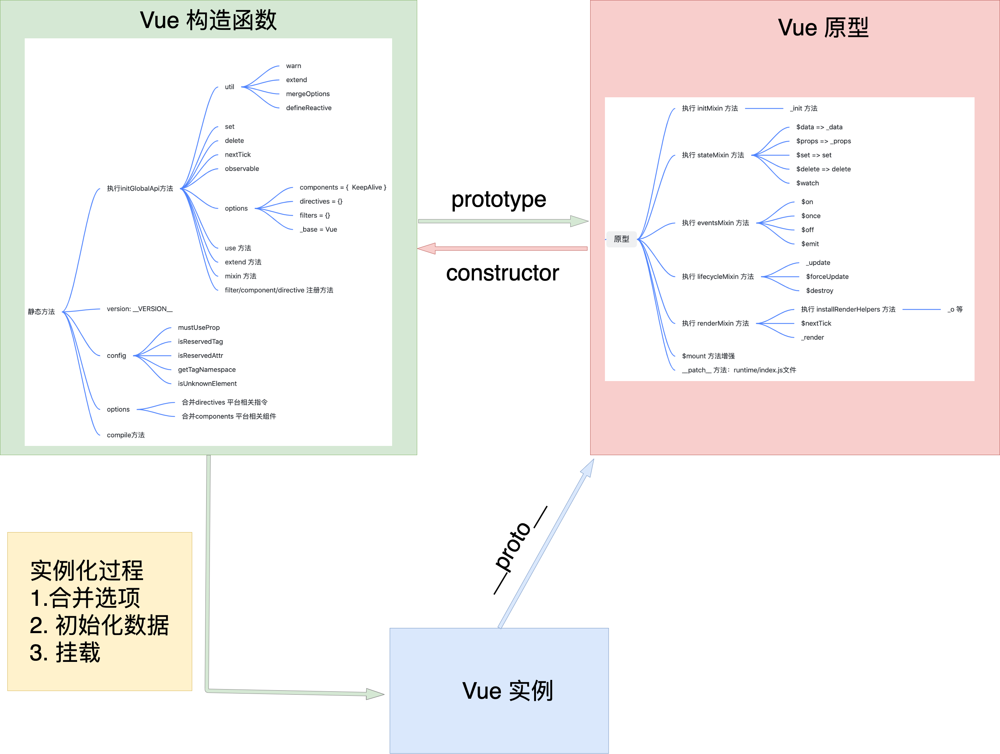

# Vue设计思路

## `项目文件结构`

在`Vue`项目中，所有核心的代码都是在`src`目录下完成，为了更好的了解`Vue`的底层实现，我们首先来了解一下`src`目录下代码的组织情况，从全局入手，在脑海里留下简单的印象，方便后续的学习。（注意：当前使用`Vue`的版本为`2.6.12`，不同版本的内容可能会有所差异）

```javascript
.
├── compiler  // 编译模块：将 template 编译成为可以生成 vnode 的 render 函数
│   ├── codeframe.js
│   ├── codegen             // 代码生成文件：根据 ast 树可生成 vnode 的 render代码
│   ├── create-compiler.js  // 创建编译器的工厂函数
│   ├── directives          // 指令解析：v-on, v-bind, v-model
│   ├── error-detector.js   
│   ├── helpers.js          // 编译相关方法，如属性获取等方法
│   ├── index.js            // 入口文件
│   ├── optimizer.js        // 编译优化：将 ast 树进行优化
│   ├── parser                      // html 解析文件：将 template 解析成 ast 树🌲
│   └── to-function.js      // 创建编译器的工厂函数
├── core     // 构造函数核心模块：构建Vue构造函数，添加原型方法，实现完成渲染流程的_init方法
│   ├── components  // 自带的全局组件，如 keep-alive
│   ├── config.js   // 配置相关
│   ├── global-api  // 全局api，如 Vue.use, extend, mixin, component等方法
│   ├── index.js    // 入口文件，在 Vue 上挂载全局方法并导出 Vue
│   ├── instance    // 构造函数起始位置
│   ├── observer    // 响应式原理
│   ├── util        // 一些工具方法，包含 mergeOptions, nextTick 等方法的实现
│   └── vdom        // 虚拟 dom
├── platforms // 平台相关，包含不同平台的不同构建入口，这里主要研究web端
│   ├── weex
│   └── web
│       ├── compiler   // 与平台相关的编译
│       ├── entry-compiler.js // vue-template-compiler 包的入口文件
│       ├── entry-runtime-with-compiler.js // 构建入口，包含编译器
│       ├── entry-runtime.js  // 构建入口，不包含编译器，不支持 template 转换 render
│       ├── entry-server-basic-renderer.js
│       ├── entry-server-renderer.js
│       ├── runtime   // 与平台相关的构建
│       ├── server
│       └── util
│
├── server    // 服务端渲染相关
├── sfc       // 包含单文件组件(.vue文件)的解析逻辑，用于vue-template-compiler包
└── shared    // 代码库通用代码
    ├── constants.js
    └── util.js
```

以上是`Vue`项目中主要文件目录，里面附带一些注释，讲解了比较主要模块的功能及作用。刚开始学习时只做简单了解即可，后面我们会逐步详细学习其中的一些模块，从而从原理级别理解整个`Vue`项目的设计与实现。


## `Vue`的真面目

要想真正的了解`Vue`是怎样的，首先我们需要找到`Vue`是咋哪里被定义的。我们先找到`package.json`文件下的`scripts`配置。`scripts`里存放的都是运行命令的别名形式，通过命令可以轻松找到对应命令执行文件的路径。

```javascript
"scripts": {
    "dev": "rollup -w -c scripts/config.js --environment TARGET:web-full-dev"
 }
```

这里当运行`dev`命令实际上是运行`scripts/config.js`文件，让我们找到`scripts/config.js`文件。

通过运行命令参数我们可以知道`process.env.TARGET`的值为`web-full-dev`，因此可以在`builds`里找到对应的配置文件，如下

```javascript
const builds = {
  'web-full-dev': {
      entry: resolve('web/entry-runtime-with-compiler.js'),
      dest: resolve('dist/vue.js'),
      format: 'umd',
      env: 'development',
      alias: { he: './entity-decoder' },
      banner
   }
  ...
}

module.exports = genConfig(process.env.TARGET)
```

通过`entry`，我们找到`web/entry-runtime-with-compiler.js`文件：

```javascript
import Vue from './runtime/index'

const mount = Vue.prototype.$mount
Vue.prototype.$mount = function (
  el?: string | Element,
  hydrating?: boolean
): Component {
  ...
}
Vue.compile = compileToFunctions

export default Vue
```

在这里，我们终于找到了`Vue`相关的文件，这也是`Vue`的起始入口。接着根据`Vue`的引入路径，找到`./runtime/index`文件：

```javascript
import Vue from 'core/index'
...
Vue.prototype.__patch__ = inBrowser ? patch : noop
Vue.prototype.$mount = function (
  el?: string | Element,
  hydrating?: boolean
): Component {
  ...
}
export default Vue
```

这里还不是`Vue`真正的起始点，继续查找`core/index`文件：

```javascript
import Vue from './instance/index'
initGlobalAPI(Vue)
...
Vue.version = '__VERSION__'
export default Vue
```

发现仍然不是`Vue`的起始点，继续查找`'./instance/index'`文件：

```javascript
import { initMixin } from './init'
import { stateMixin } from './state'
import { renderMixin } from './render'
import { eventsMixin } from './events'
import { lifecycleMixin } from './lifecycle'
import { warn } from '../util/index'

// Vue 构造函数
function Vue (options) {
  if (process.env.NODE_ENV !== 'production' &&
    !(this instanceof Vue)
  ) {
    warn('Vue is a constructor and should be called with the `new` keyword')
  }
  this._init(options)
}

// 向原型上添加方法属性
initMixin(Vue)
stateMixin(Vue)
eventsMixin(Vue)
lifecycleMixin(Vue)
renderMixin(Vue)

export default Vue
```

好了，大功告成！费劲千辛万苦终于找到了`Vue`的真正定义的位置！可以看出`Vue`其实就是一个构造函数，而构造函数内部仅仅只是调用了`_init`方法，看上去非常简单。但是`Vue`是如何通过这么简单的定义实现那么复杂的功能呢？这里就要涉及到`构造函数`、`原型`、`实例`的概念了，不了解这些概念的建议参考《javascript高级设计程序》中原型章节来进行学习。下面我们通过下方三个方面来介绍`Vue`的实现。

1. 原型方法属性：通过 5 个 `init` 方法，向`Vue`的原型上添加方法，
2. 静态方法属性：在导入`Vue`构造函数的过程中，向`Vue`构造函数上添加静态方法，也有向原型上添加方法
3. 实例化：在实例化的过程中，执行`_init`方法，完成整个`Vue`初始化到渲染的逻辑。


## Vue的原型方法属性

### `initMixin`

`initMixin`方法主要实现了`_init`方法。

```javascript
export function initMixin (Vue: Class<Component>) {
  Vue.prototype._init = function (options?: Object) {
    // init 实现内容，由于这里仅做概览，所以具体实现均已省略
    ... 
  }
}
```

从上面`Vue`构造函数我们可以知道，这个方法在实例化时有被调用，它主要的作用是实现：选项的合并，数据初始化（如响应式处理），以及触发编译和渲染的流程，所以十分重要。这里也只是先做一个了解，后续的实例化章节将都会从这个方法开始分析。


### `stateMixin`

`stateMixin`主要实现了`data,props`的代理功能，即当我们访问`$data`时，实际访问的是`_data`。另外在非生产环境下，会对`$data,$props`进行 `set`处理，每次设置新的值时都会打印提示，所以实际上`$data,$props`都是只读属性。

```javascript
export function stateMixin (Vue: Class<Component>) {
  const dataDef = {}
  dataDef.get = function () { return this._data }
  const propsDef = {}
  propsDef.get = function () { return this._props }
  // 只读属性
  if (process.env.NODE_ENV !== 'production') {
    dataDef.set = function () {
      warn(
        'Avoid replacing instance root $data. ' +
        'Use nested data properties instead.',
        this
      )
    }
    propsDef.set = function () {
      warn(`$props is readonly.`, this)
    }
  }
  Object.defineProperty(Vue.prototype, '$data', dataDef)
  Object.defineProperty(Vue.prototype, '$props', propsDef)
  Vue.prototype.$set = set
  Vue.prototype.$delete = del
  Vue.prototype.$watch = function () { ... }
}
```

除此之外，这里还在`Vue`原型上挂载了比较常见的三个方法：`$set`，`$delete`，`$watch`。


### `eventsMixin`

和`node`里`EventEmitter`类似，`eventsMixin`实现了四个方法：`$on,$off,$once,$emit`，用于监听，触发，销毁事件。

```javascript
export function eventsMixin (Vue: Class<Component>) {
  const hookRE = /^hook:/
  Vue.prototype.$on = function () { ... }
  Vue.prototype.$once = function () { ... }
  Vue.prototype.$off = function () { ... }
  Vue.prototype.$emit = function () { ... }
}
```


### `lifecycleMixin`

`lifecycleMixin`实现了三个方法：`_update`方法非常重要，它主要负责将`vnode`生成真实节点。

```javascript
export function lifecycleMixin (Vue: Class<Component>) {
  // 更新，将 vnode 生成 真实节点
  Vue.prototype._update = function () { ... }
  // 强制刷新
  Vue.prototype.$forceUpdate = function () { ... }
  // 销毁
  Vue.prototype.$destroy = function () { ... }
}
```


### `renderMixin`

`renderMixin`主要做了三项工作

```javascript
export function renderMixin (Vue: Class<Component>) {
  installRenderHelpers(Vue.prototype)

  Vue.prototype.$nextTick = function (fn: Function) {
    return nextTick(fn, this)
  }
  
  Vue.prototype._render = function (): VNode {
    return vnode
  }
}
```


1. `installRenderHelpers`函数用于添加`render`相关方法，在编译环节最后生成的代码，都是由这些方法拼接而成的代码，所以也是非常的重要，在这里先混个眼熟。

```javascript
  target._o = markOnce
  target._n = toNumber
  target._s = toString
  target._l = renderList
  target._t = renderSlot
  target._q = looseEqual
  target._i = looseIndexOf
  target._m = renderStatic
  target._f = resolveFilter
  target._k = checkKeyCodes
  target._b = bindObjectProps
  target._v = createTextVNode
  target._e = createEmptyVNode
  target._u = resolveScopedSlots
  target._g = bindObjectListeners
  target._d = bindDynamicKeys
  target._p = prependModifier
```

1. `$nextTick`方法，在下一次事件循环触发，涉及到事件循环机制。
2. `_render`方法，用于生成`vnode`。


## Vue的静态方法属性

通过上面5个`init`方法我们已经了解了许多原型方法的添加过程，但是在`Vue`中还有很多全局方法，比如`Vue.component,Vue.use`等方法，它们都是构造函数的静态属性，下面我们看看这些静态属性是如何添加的。与寻找`Vue`的起始位置过程恰恰相反，这次我们从`Vue`的起始文件出发，看看最后导出的`Vue`是怎样的。


### `/src/core/index.js`文件

这是第一层引入`Vue`构造函数的文件

```javascript
import { initGlobalAPI } from './global-api/index'

initGlobalAPI(Vue)

// ... 中间省略

Vue.version = '__VERSION__'
```

这里我们看一下`initGlobalAPI`方法，打开`core/global-api/index.js`文件

```javascript
export function initGlobalAPI (Vue: GlobalAPI) {
  Vue.util = {
    warn,
    extend,
    mergeOptions,
    defineReactive
  }

  Vue.set = set
  Vue.delete = del
  Vue.nextTick = nextTick

  // 2.6 explicit observable API
  Vue.observable = <T>(obj: T): T => {
    observe(obj)
    return obj
  }

  Vue.options = Object.create(null)
  ASSET_TYPES.forEach(type => {
    Vue.options[type + 's'] = Object.create(null)
  })

  Vue.options._base = Vue

  extend(Vue.options.components, builtInComponents)

  initUse(Vue)
  initMixin(Vue)
  initExtend(Vue)
  initAssetRegisters(Vue)
}
```

这里挂载了很多静态方法，`Vue`中大多数的全局方法都在这个位置添加的，这里我们着重分析一下`options`：

```javascript
  import builtInComponents from '../components/index'  

  Vue.options = Object.create(null)
  ASSET_TYPES.forEach(type => {
    Vue.options[type + 's'] = Object.create(null)
  })

  Vue.options._base = Vue

  extend(Vue.options.components, builtInComponents)  
```

可以看出，在`Vue`构造函数上添加了一个`options`属性（注意！这里是静态属性，为构造函数所有，区别于在实例化传入的`options`）。随后又通过遍历`ASSET_TYPES`，在`options`上添加了`components,directives,filters`方法。另外还添加了`_base`，指向当前构造函数。最后通过`extend`方法将`builtInComponents`合并到`options.components`当中。这里的`builtInComponents`实际上就是`Vue`自带的组件，即`keep-alive`组件。所以最终`Vue.options`的内容如下：

```javascript
// Vue.options 内容
{
    components: {
    KeepAlive
  },
  filters: {},
  directives: {},
  _base: Vue
}
```

这里之所以额外提起，是因为在后续选项合并时，会使用此处的`options`进行合并。


### `/src/platforms/web/runtime/index.js`文件

这里是第二层引入`Vue`的文件，主要给`Vue`处理平台相关的一些方法

```javascript
import Vue from 'core/index'
import config from 'core/config'
import { extend, noop } from 'shared/util'
import { mountComponent } from 'core/instance/lifecycle'
import { devtools, inBrowser } from 'core/util/index'

import {
  query,
  mustUseProp,
  isReservedTag,
  isReservedAttr,
  getTagNamespace,
  isUnknownElement
} from 'web/util/index'

import { patch } from './patch'
import platformDirectives from './directives/index'
import platformComponents from './components/index'

// install platform specific utils
Vue.config.mustUseProp = mustUseProp
Vue.config.isReservedTag = isReservedTag
Vue.config.isReservedAttr = isReservedAttr
Vue.config.getTagNamespace = getTagNamespace
Vue.config.isUnknownElement = isUnknownElement

// install platform runtime directives & components
extend(Vue.options.directives, platformDirectives)
extend(Vue.options.components, platformComponents)

Vue.prototype.__patch__ = inBrowser ? patch : noop
Vue.prototype.$mount = function () { ... }

export default Vue
```

这里首先给`Vue.config`添加了一系列方法，注意，这些方法之所以在这里添加而不是在`core/index.js`文件里添加，是因为这里的方法都与平台相关，不同的平台的方法实现也会不一样。

```javascript
extend(Vue.options.directives, platformDirectives)
extend(Vue.options.components, platformComponents)
```

这两个`extend`实际上进一步扩充了`Vue.options`方法，扩充后的内容如下

```javascript
// Vue.options 内容
{
    components: {
    KeepAlive,
    // 新增 platformComponents
    Transition,
    // 新增 platformComponents
    TransitionGroup
  },
  filters: {},
  directives: {
    // 新增 platformDirectives
    model,
    // 新增 platformDirectives
    show
  },
  _base: Vue
}
```

这也是为什么我们可以不用注册也能全局使用`v-model,v-show`的原因了，因为`Vue`已经帮我们全局注册了。


### `/src/platforms/web/entry-runtime-with-compiler.js`文件

这是最后一层引入`Vue`了

```javascript
import Vue from './runtime/index'
...

const mount = Vue.prototype.$mount
Vue.prototype.$mount = function (
  el?: string | Element,
  hydrating?: boolean
): Component {
    
    ...
    
  return mount.call(this, el, hydrating)
}

Vue.compile = compileToFunctions

export default Vue
```

这里主要是重新实现了`$mount`方法，但是为什么原先在`runtime/index.js`文件里实现了`$mount`方法，这里又要重新实现一遍呢？因为`runtime/index.js`里的`$mount`与编译是无关的，无法处理`template`模板代码，而这里重写的`$mount`实际上还是调用了`runtime/index.js`里的`$mount`，但是在此之前，增加了从`template`到`render`的编译过程。


## 实例化过程

前面已经将`Vue`的各种方法属性挂载完毕，现在则是需要进行实例化了，也就是调用之前提到的`_init`方法。打开`/src/core/instance/init.js`文件，代码如下：

```javascript
Vue.prototype._init = function (options?: Object) {
    const vm: Component = this
    ...

    // 1. 合并options
    if (options && options._isComponent) {
      initInternalComponent(vm, options)
    } else {
      vm.$options = mergeOptions(
        resolveConstructorOptions(vm.constructor),
        options || {},
        vm
      )
    }
  
    ...

    // 2. 初始化数据
    initLifecycle(vm)
    initEvents(vm)
    initRender(vm)
    callHook(vm, 'beforeCreate')
    initInjections(vm) // resolve injections before data/props
    initState(vm)
    initProvide(vm) // resolve provide after data/props
    callHook(vm, 'created')

    // 3. 挂载
    if (vm.$options.el) {
      vm.$mount(vm.$options.el)
    }
  }
```

在初始化的过程中，主要分为三个阶段：

阶段一：合并选项，将 `Vue.options`和传入的`options`进行合并

阶段二：初始化数据，并对数据进行响应式处理

阶段三：编译代码，得到`render`函数，将`vnode`生成真实节点，并挂载到界面

由于这部分比较核心，且难以理解，这里仅做了解，后续会逐一进行分析。


## Vue的整体设计

通过上面的分析，我们已经对`Vue原型方法`，`Vue静态方法属性`，`Vue实例化过程`有了大致的了解，下面我们用张图总结下整体的内容，也就是Vue整体的设计思路。



总结下来就是：

1. 构建一个具有完备功能的构造函数，因此在上面添加各个模块需要的方法属性。包括原型方法属性和静态方法属性。
2. 进行实例化，在实例化过程中进行各种处理，其中包括：选项合并，数据响应式处理，编译，虚拟`DOM`更新等等。


这里的描述比较笼统，旨在从整体上来对Vue进行一个了解。在接下来的章节我们会详细分析实例化的整个过程，从而由点及面的了解Vue。下一章节我们将开始`Vue`核心代码的正式学习。

