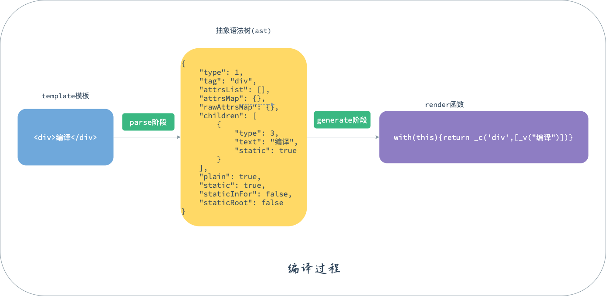

# 编译过程之generate方法

先简单复习一下`Vue`的编译过程，整个过程分为三个步骤：

第一步是**parse解析阶段**，前面的章节已经讲过`parse`方法的具体实现，该方法主要是将`template`编译成易于处理的抽象语法树(`ast`)。

第二步是**optimize优化阶段**，该阶段主要是将`template`中的静态节点在`ast`中标记出来，方便后续生成虚拟`Dom`的时候进行复用。

第三步是**generate生成代码阶段**，也是我们这章要学习的部分。该阶段是将`ast`树转换成能生成对应虚拟`Dom`的`render`函数。



这一章我们主要讨论`generate`阶段，看看抽象语法树是如何转换成`render`函数的。

## with语法

我们先看下最终生成的代码代表的是什么意思：

```javascript
with(this){return _c('div',[_v("编译")])}
```

从生成的代码可以看出，`render`函数是以`with`开头的，我们先了解下`with`是如何使用的。

```javascript
const obj = { a: 3 }
with (obj) {
	console.log(a) // 3
  console.log(this.a) // undefined
  console.log(b) // 报错
}
```

借用[mdn](https://developer.mozilla.org/zh-CN/docs/Web/JavaScript/Reference/Statements/with)上的一句话：**with语句**扩展一个语句的作用域链。本来访问`a`的时候是访问的全局作用域，加了`with`之后，访问`a`的作用域则是`obj`。`with`使用起来相对比较简单。回到`Vue`的`render`函数中，可以知道`render`函数里的作用域就是`Vue`的实例`vm`，所以`render`执行的时候，访问变量实质上就是访问`Vue`实例上的属性。至于为什么要使用`with`语法，可以看下尤大大的[一篇回答](https://www.zhihu.com/question/49929356)。

## renderHelpers

还是那段编译生成的代码，在`with`内部的代码中有`_c`，`_v`这样的方法。由于`this`是指向`Vue`实例的，所以访问`_c`的时候其实访问的是`vm._c`。但是`_c`、`_v`这些方法是哪里定义的呢？

```javascript
with(this){return _c('div',[_v("编译")])}
```

这就要追溯到`Vue`构造函数与原型的章节了，在`src/core/instance/render.js`文件中找到`renderMixin`方法，这个方法是在我们学习`Vue`原型设计的时候提到的：

```javascript
export function renderMixin (Vue: Class<Component>) {
  // install runtime convenience helpers
  installRenderHelpers(Vue.prototype)
  Vue.prototype.$nextTick = function (fn: Function) {...}
  Vue.prototype._render = function (): VNode {...}
}
```

在`./render-helpers`找到`installRenderHelpers`函数：

```javascript
export function installRenderHelpers (target: any) {
  target._o = markOnce
  target._n = toNumber
  target._s = toString
  target._l = renderList
  target._t = renderSlot
  target._q = looseEqual
  target._i = looseIndexOf
  target._m = renderStatic
  target._f = resolveFilter
  target._k = checkKeyCodes
  target._b = bindObjectProps
  target._v = createTextVNode
  target._e = createEmptyVNode
  target._u = resolveScopedSlots
  target._g = bindObjectListeners
  target._d = bindDynamicKeys
  target._p = prependModifier
}
```

`installRenderHelpers`主要任务就是挂载了渲染需要用到的函数！所以调用`_v`就是调用`createTextVNode`方法，从字面意思我们就可以知道，其实它就是创建一个文本的`Vnode`节点。但是这里并没有定义`_c`，那么`_c`在哪呢？还记得数据初始化环节吗，同样是在`src/core/instance/render.js`文件中，不过是`initRender`方法：

```javascript
export function initRender (vm: Component) {
  ...
  vm._c = (a, b, c, d) => createElement(vm, a, b, c, d, false)
  vm.$createElement = (a, b, c, d) => createElement(vm, a, b, c, d, true)
	...
}
```

`_c`同样是创建`Vnode`节点的函数。所以`render`函数就是由一堆生成`Vnode`节点函数的集合。接下来我们看下具体是如何使用这些函数的。

## generate

`generate`过程的代码都是在`src/compiler/codegen`目录中，里面只有两个文件，相对来说比较少。在`index.js`中找到`generate`函数：

```javascript
export function generate (
  ast: ASTElement | void,
  options: CompilerOptions
): CodegenResult {
  const state = new CodegenState(options)
  const code = ast 
  	? (ast.tag === 'script' ? 'null' 
	  : genElement(ast, state)) : '_c("div")'
  return {
    render: `with(this){return ${code}}`,
    staticRenderFns: state.staticRenderFns
  }
}
```

里面的核心实现是调用了`genElement`方法：

```javascript
  if (el.staticRoot && !el.staticProcessed) {
    return genStatic(el, state)
  } else if (el.once && !el.onceProcessed) {
    return genOnce(el, state)
  } else if (el.for && !el.forProcessed) {
    return genFor(el, state)
  } else if (el.if && !el.ifProcessed) {
    return genIf(el, state)
  } else if (el.tag === 'template' && !el.slotTarget && !state.pre){
    return genChildren(el, state) || 'void 0'
  } else if (el.tag === 'slot') {
    return genSlot(el, state)
  } else {...}
```

可以看出，`genElement`里面有很多判断逻辑，根据不同的判断条件调用不同的生成函数。我们分别看下各个生成函数是怎样的。

## genStatic

`staicRoot`是在`optimize`优化阶段添加的。当`el.staicRoot`为`true`时，代表`el`是静态节点：

```javascript
state.staticRenderFns.push(`with(this){return ${genElement(el, state)}}`)

return `_m(${
    state.staticRenderFns.length - 1
  }${
    el.staticInFor ? ',true' : ''
  })`
```

这里主要的代码就两行。``with(this){return ${genElement(el, state)}}``就是将`el`生成`Vnode`的代码，然后将其添加到`staticRenderFns`中，再使用`_m`函数进行封装一遍，`_m`函数又是调用的`renderStatic`函数：

```javascript
  const cached = this._staticTrees || (this._staticTrees = [])
  let tree = cached[index]
  if (tree && !isInFor) {
    return tree
  }

  tree = cached[index] = this.$options.staticRenderFns[index].call(
    this._renderProxy,
    null,
    this // for render fns generated for functional component templates
  )
  markStatic(tree, `__static__${index}`, false)
  return tree
```

通过代码不难看出，该方法将`staticRenderFns[index].call()`生成的`Vnode`缓存到`_staticTrees`上了。`_staticTrees`键为`index`，值为生成的`Vnode`，下次执行`renderStatic`函数的时候，就会从`_staticTrees`取出相应的`Vnode`，从而跳过执行`staticRenderFns[index].call()`，达到优化编译速度的目的。另外这里的`_staticTrees`也是在`initRender`的时候初始化的。

## genFor

```javascript
return `${altHelper || '_l'}((${exp}),` +
    `function(${alias}${iterator1}${iterator2}){` +
      `return ${(altGen || genElement)(el, state)}` +
    '})'
```

`genFor`方法比较简单，主要是调用了`_l`方法(即`renderList`方法)，将解析的`exp,alias,iterator1,iterator2`作为参数传入，然后循环`exp`调用`genElement`生成`Vnode`数组。

## genIf/genIfConditions

在`parse`解析`template`的时候，会将`if/else-if/else`三种情况解析成一个数组，类似于下方这样的形式：

```javascript
// 解析前
<div v-if="isTrue">编译1</div>
<div v-else-if="isFalse">编译2</div>
<div v-else>编译3</div>

// 解析后
[
	{
		"exp": "isTrue",
 		"block": "存放isTrue为true的时候显示的 el"
	},
  {
		"exp": "isFalse",
 		"block": "存放isFalse为true的时候显示的 el"
	},
  {
  	"block": "存放其他情况显示的 el
  }
]
```

所以我们需要遍历这个数组，然后依次判断`exp`是否为`true`，如果为`true`就显示`block`里存放的`el`。回到`genIf`函数，它调用的则是`genIfConditions`函数：

```javascript
const condition = conditions.shift()
  if (condition.exp) {
    return `(${condition.exp})?${
      genTernaryExp(condition.block)
    }:${
      genIfConditions(conditions, state, altGen, altEmpty)
    }`
  } else {
    return `${genTernaryExp(condition.block)}`
  }
```

`genIfConditions`每次会从数组中取一个条件出来，判断是否成立。如果不成立就递归调用`genIfConditions`，直到所有的判断条件取完。

## genOnce

`genOnce`主要分为三种情况：

- 与`if`并存，这个时候就先执行`genIf`再执行`genOnce`。
- 在`for`循环中且为静态节点，用`_o`方法进行标记。
- 否则使用`genStatic`方法生成节点，`genStatic`具有缓存性。

## genChildren/genNode

`genChildren`是一个递归的过程，通过遍历`children`节点然后调用`genNode`方法生成`Vnode`:

```javascript
 if (node.type === 1) {
    return genElement(node, state)
  } else if (node.type === 3 && node.isComment) {
    return genComment(node)
  } else {
    return genText(node)
  }
```

如果是`node.type`为1，那么又会回到`genElement`方法继续生成`Vnode`。否则生成文本节点或注释节点。

## genComponent

```javascript
const children = el.inlineTemplate ? null : genChildren(el, state, true)
return `_c(${componentName},${genData(el, state)}${
    children ? `,${children}` : ''
  })`
```

`genComponent`比较简单，和普通节点生成类似，不同点则是标签名称是组件名称。

## genData

`genData`的主要作用是处理属性相关的内容，如指令、属性、`props`、绑定事件等等，它们分别通过`genDirectives`、`genProps`、`genHandlers`等函数进行分别处理的。这里主要看一下`slot`相关的方法：`genScopedSlots`。

```javascript
// 编译前
<div>
  <template v-slot:header="header">编译header</template>
  <template v-slot:footer="footer">编译footer</template>
</div>

// 编译后 ast 大致内容
{
	scopedSlots: {
  	header: {
    	...
      节点header
    },
    footer: {
    	...
      节点footer
    }
  }
}
```

`genScopedSlots`则是遍历`scopedSlots`生成节点：

```javascript
const generatedSlots = Object.keys(slots)
    .map(key => genScopedSlot(slots[key], state))
    .join(',')
```

单个节点生成使用的是`genScopedSlot`方法：

```javascript
function genScopedSlot (
  el: ASTElement,
  state: CodegenState
): string {
	...
  const fn = `function(${slotScope}){` +
    `return ${el.tag === 'template'
      ? el.if && isLegacySyntax
        ? `(${el.if})?${genChildren(el, state) || 'undefined'}:undefined`
        : genChildren(el, state) || 'undefined'
      : genElement(el, state)
    }}`
  ...
  return `{key:${el.slotTarget || `"default"`},fn:${fn}${reverseProxy}}`
}
```

该方法的作用是将插槽内要插入的`children`生成了`Vnode`，最终的生成结果如下：

```javascript
{
  scopedSlots: _u([
    {
      key: 'header',
      fn: function (header) {
        return [_v('编译1')]
      }
    },
    {
      key: 'footer',
      fn: function (footer) {
        return [_v('编译2')]
      }
    }
  ])
}
```

`_u`方法调用的是`resolveScopedSlots`方法，该方法主要将上面的数组形式转换成了对象形式，如：

```javascript
{
	header: function (header) {
        return [_v('编译1')]
      },
	footer: function (footer) {
        return [_v('编译2')]
      }
}
```

## genSlot

`genSlot`的核心过程是使用了`_t`方法：

```javascript
let res = `_t(${slotName}${children ? `,${children}` : ''}`
```

我们看一下`_t`也就是`renderSlot`方法：

```javascript
const scopedSlotFn = this.$scopedSlots[name]
  let nodes
  if (scopedSlotFn) { // scoped slot
    props = props || {}
    if (bindObject) {
      if (process.env.NODE_ENV !== 'production' && !isObject(bindObject)) {
        warn(
          'slot v-bind without argument expects an Object',
          this
        )
      }
      props = extend(extend({}, bindObject), props)
    }
    nodes = scopedSlotFn(props) || fallback
  } else {
    nodes = this.$slots[name] || fallback
  }

  const target = props && props.slot
  if (target) {
    return this.$createElement('template', { slot: target }, nodes)
  } else {
    return nodes
  }
```

首先`this.$scopedSlots[name]`就是拿到父组件中可以将插槽内容生成`Vnode`的函数，然后执行生成`Vnodes`数组，添加到子组件中。这里还有其他判断，主要对应于是否是具名插槽，是否有插槽传值等情况。这个在后面插槽章节再详细讲解，这里先简单了解一下。

## 总结

编译过程中`generate`的阶段，实际上就是将抽象语法树根据不同的情景使用不同的`render`工具方法拼接成可以生成`Vnode`的`render`函数。类似于`for/if`这些语法，经过`generate`处理后，都会根据相应的数据逻辑生成对应的`Vnode`。事实上，这个`Vnode`的结构和我们真实`Dom`的结构相差无几，下一步要做的就是将虚拟`Dom`映射成真实`Dom`了。