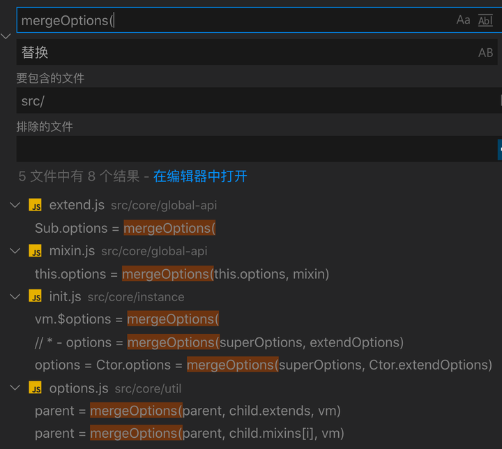
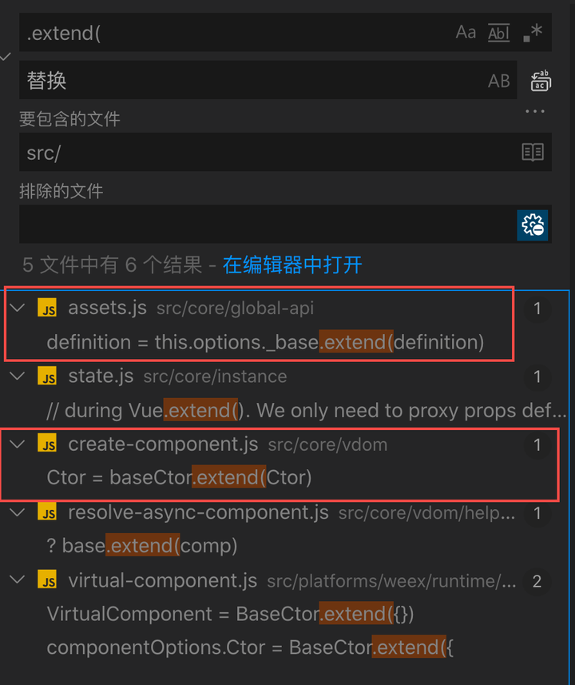

# 选项合并

在`Vue`的初始化过程中，最开始的阶段就是选项合并阶段。它通过调用`mergeOptions`函数将两个选项配置合并成一个选项配置。这里的选项`options`的形式实际上就是我们平时开发时在`Vue`中写的对象配置，形式如下：

```json
{ 
  components: {}, 
  filters: {},
  data() { return {} }, 
  computed: {}, 
  created: {}, 
  methods: {},
  ... 
}
```

因此，选项合并实际可以简单的看作是两个上面的对象合并成一个对象。


由于`mergeOptions`是实现**实例化**(`new Vue(options)`)、**继承**(`Vue.extend`)和**混入**(`Vue.mixin`)三大功能的核心函数，所以分析它的实现是理解`Vue`实例化过程和继承的必经之路。 下面我们将从以下几个方面来全面了解`Vue`中的选项合并：

1. 实例化过程中的选项，了解我们需要合并的选项是怎样的。
2. `mergeOptions`的实现，了解各个合并策略。

1. 继承(`Vue.extend`和`extends:{}`)的选项合并。
2. 混入(`Vue.mixin`和`mixins:[]`)的选项合并。

1. 为什么实例化过程中有时用`initInternalComponent`而不是`mergeOptions`。

## 实例化过程中的选项

从上一节的学习我们知道，`Vue`的实例化过程调用的是`core/instance/init.js`文件中的`_init`方法。

```javascript
Vue.prototype._init = function (options?: Object) {
    const vm: Component = this
  
  	...
  
    vm.$options = mergeOptions(
      resolveConstructorOptions(vm.constructor),
      options || {},
      vm
    )
  
  	...
  }
```

实例化的过程中第一个重要的处理就是选项的合并，这里第二个参数比较容易理解，就是我们平时写的`Vue`的配置项。第一个参数则是通过`resolveConstructorOptions(vm.constructor)`生成，找到`resolveConstructorOptions`方法，代码如下

```javascript
// * 返回构造函数的 options
export function resolveConstructorOptions (Ctor: Class<Component>) {
  // * 如果不是继承，options 就是原构造函数的 options
  // * 如果是继承时，options 为合并 superOptions 和 extendOptions 的 options
  // * 此外，这里的 options 还包含了全局注册的 组件/指令/过滤器
  let options = Ctor.options
  // * Ctor.super 存在说明是调用了 extend 方法进行继承生成的构造函数
  // * 详见 /src/core/global-api/extend.js 文件
  // * - superOptions 是父类 options
  // * - extendOptions 是当前类传入的 options (如果与 sealedOptions不同，需要合并)
  // * - options = mergeOptions(superOptions, extendOptions)
  // * - sealedOptions 保存的是当前类继承时 合并后的 options(是extend的时候赋值的)
  if (Ctor.super) {
    const superOptions = resolveConstructorOptions(Ctor.super)
    const cachedSuperOptions = Ctor.superOptions
    // * 如果 superOptions 变动了，需要处理新的 options
    if (superOptions !== cachedSuperOptions) {
      Ctor.superOptions = superOptions
      // * sealedOptions 是 seal 的时候赋值的，
      // * 这里的变动可能是 options 在 extend 后继续被赋值
      // * 复现：https://jsfiddle.net/vvxLyLvq/2/
      // * 所以需要找出变动了的属性，然后更新到 extendOptions 上
      // * 这里的 extend 只是对象的合并
      const modifiedOptions = resolveModifiedOptions(Ctor)
      if (modifiedOptions) {
        extend(Ctor.extendOptions, modifiedOptions)
      }
      // * 由于 options 变化了，重新合并一次
      options = Ctor.options = mergeOptions(superOptions, Ctor.extendOptions)
      if (options.name) {
        // * 将自身的构造函数也存到了 components 对象中
        options.components[options.name] = Ctor
      }
    }
  }
  return options
}
```

这里传入的是当前构造函数，那么`Ctor.options`指的是`Vue`构造函数的`options`，还记得上一节中提到的`Vue.options`吗？这里将`options`的内容从上一节中复制过来，代码如下：

```javascript
// Vue.options 内容
{
	components: {
  	KeepAlive,
    // 新增 platformComponents
    Transition,
    // 新增 platformComponents
    TransitionGroup
  },
  filters: {},
  directives: {
  	// 新增 platformDirectives
    model,
    // 新增 platformDirectives
    show
  },
  _base: Vue
}
```

再看下一句`Ctor.super`的判断，`super`这个字段是在`core/global-api/extend.js`文件中的`extend`方法调用时添加的。如果`Ctor.super`存在，说明`Ctor`是通过继承而来的子构造函数。**但是，如果在**`extend`**后，我们又在父构造函数的**`options`**上添加新的属性，这个时候子构造函数是无法继承新的属性的。因此，这里需要通过**`Ctor.super`**向上寻找，找出所有父构造函数更新的**`options`**属性，并更新到子构造函数上，这样就能解决**`Vue.options`**被更改的问题了。**有兴趣的话，可以看一下`Vue`的[issues#4976](https://github.com/vuejs/vue/issues/4976)。


最后，经过`resolveConstructorOptions`处理后，最终得到的同样是一个`Vue`的配置选项，下一步则是需要将这两个配置选项进行合并了。

## `mergeOptions`的实现

### 选项校验和规范化

`mergeOptions`函数的定义是在`/src/core/util/options.js`文件当中，部分代码如下：

```javascript
export function mergeOptions (
  parent: Object,// 选项
  child: Object, // 选项
  vm?: Component // Vue 实例
): Object {
  // * 1. 校验选项中的 components 里的名称是否合法。
  if (process.env.NODE_ENV !== 'production') {
    checkComponents(child)
  }
  
  // * ['type1'], { type2: { type: String, default: '' } } 两种形式
  // * 2. 都转换成后一种形式
  normalizeProps(child, vm)
  
  // * ['injectKey1'], { injectKey2: { from: 'xxx', default: 'yyy' } } 两种形式
  // * 3. 都转换成后一种形式
  normalizeInject(child, vm)
  
  // * directive 有两种形式 function() {} 或者是 { bind, update, ... }
  // * 4. 都转换成后一种形式
  normalizeDirectives(child)

  // * 合并策略
	...
}
```

在正式合并之前，会优先校验`components`里的组件名称是否合法，如果不合法会进行提示。

```javascript
function checkComponents (options: Object) {
  for (const key in options.components) {
    validateComponentName(key)
  }
}

// 校验组件名称是否合法
export function validateComponentName (name: string) {
  // 1. 判断组件名是否合法，如数字开头的则不合法
  if (!new RegExp(`^[a-zA-Z][\\-\\.0-9_${unicodeRegExp.source}]*$`).test(name)) {
    warn(
      'Invalid component name: "' + name + '". Component names ' +
      'should conform to valid custom element name in html5 specification.'
    )
  }
  // 2. 判断组件是否是自身定义的组件名，如 slot 等。
  // 3. 判断组件是否是 html 中的标签名，如 div 等
  if (isBuiltInTag(name) || config.isReservedTag(name)) {
    warn(
      'Do not use built-in or reserved HTML elements as component ' +
      'id: ' + name
    )
  }
}
```

除此之外， `Vue`还做了以下几点处理。通过选项形式的转换，将多种写法的选项转换成统一形式：

1. `normalizeProps`方法：处理`props`，将数组形式定义的`props`转换成对象形式。
2. `normalizeInject`方法：处理`inject`，将数组形式定义的`inject`转换成对象形式。

1. `normalizeDirectives`方法：处理`directives`，将指令数组里函数形式定义的`directive`转换成对象形式。

处理前和处理后对比结果如下：

```javascript
// ===> 处理前 <===
{
	props: ['user-name'],
  inject: ['id'],
  directives: [function add() {}]
}

// ===> 处理后 <====
{
  // 对象形式
	props: {
  	userName: { // 转换成驼峰命名
    	type: null
    }
  },
  // 对象形式
  inject: {
  	id: {
    	from: 'id'
    }
  },
  directives: [{
    // 对象形式
  	bind: function add() {}
    update: function add() {}
  }]
}
```

在校验完成之后，接下里就是正式的合并流程了，`Vue`**针对每个规定的配置选项都有定义好的合并策略**，例如`data,component,mounted,methods`等。如果`Vue`父子选项配置具有相应的选项，那么直接按照相应的合并策略进行合并。合并的入口如下：

```javascript
export function mergeOptions (
  parent: Object,
  child: Object,
  vm?: Component
): Object {
 	...
  // * 合并策略
  const options = {}
  let key
  for (key in parent) {
    mergeField(key)
  }
  for (key in child) {
    if (!hasOwn(parent, key)) {
      mergeField(key)
    }
  }
  function mergeField (key) {
    // 根据 key 获取相应的合并策略
    const strat = strats[key] || defaultStrat
    // 用相应的合并策略进行合并
    options[key] = strat(parent[key], child[key], vm, key)
  }
  return options
}
```

以上通过两个`for`循环，遍历`parent`和`child`的`key`（`key`这里指的是`data/methods/created等`），然后依次调用`mergeField`方法。`mergeField`则是通过`key`在`strats`中找到对应的合并策略，然后用该合并策略进行相应合并。如果找不到合并策略，则使用默认合并策略`defaultStrat`。


这里的`strats`已经在该文件中定义，现在重点来看一下`Vue`中`strats`是如何定义合并策略的。


### `data`合并

```javascript
strats.data = function (
  parentVal: any,
  childVal: any,
  vm?: Component
): ?Function {
  if (!vm) {
    if (childVal && typeof childVal !== 'function') {
      process.env.NODE_ENV !== 'production' && warn(
        'The "data" option should be a function ' +
        'that returns a per-instance value in component ' +
        'definitions.',
        vm
      )
      return parentVal
    }
    return mergeDataOrFn(parentVal, childVal)
  }

  return mergeDataOrFn(parentVal, childVal, vm)
}
```

可以看出当`vm`不存在时，如果`childVal`即`data`不为函数形式，那么在非开发环境下就会报错，这也是为什么我们平时在写组件`data`时需要写成函数形式的原因。


但是这里的`vm`在什么情况下不存在呢？我们可以全局搜索一下`mergeOptions(`，看看哪些位置调用了该方法：



可以看出，在`extend`，`mixin`中，由于处理构造函数阶段时，是没有实例的，所以也就不会传`vm`。这里我们主要讨论`extend`。

接下来我们全局搜索一下`extend`在哪些地方被调用了。



可以看到，`extend`方法主要在两个位置被调用。

第一个位置在 `src/core/global-api/assets.js`文件

```javascript
ASSET_TYPES.forEach(type => {
    Vue[type] = function (
      id: string,
      definition: Function | Object
    ): Function | Object | void {
      	...
        if (type === 'component' && isPlainObject(definition)) {
          definition.name = definition.name || id
          // * 通过继承，返回新的构造函数（相当于 子组件 的构造函数）
          definition = this.options._base.extend(definition)
        }
     		...
        // * component / directive / filter 
        // * 将注册的内容全部添加到 Vue 构造函数的 options 上
        this.options[type + 's'][id] = definition
        return definition
    }
  })
```

通过遍历`ASSET_TYPES`，在`Vue`构造函数上添加了`component`静态属性，即当我们使用`Vue.component`的时候，实际上会执行这里的`this.options._base.extend(definition)`，即调用了`extend`方法来将传入的组件选项合并后返回新的构造函数。


第二个位置在`src/core/vdom/create-component.js`文件

```javascript
export function createComponent (
  Ctor: Class<Component> | Function | Object | void,
  data: ?VNodeData,
  context: Component,
  children: ?Array<VNode>,
  tag?: string
): VNode | Array<VNode> | void {
	...
  // * 这里的 Ctor 有几种形式
  // * 1. 全局形式定义的 component，那么 Ctor 是构造函数形式
  // * 2. 局部定义的 component，那么是 对象形式。会对对象形式进行 extend 处理
  const baseCtor = context.$options._base

  // 对象形式。会对对象形式进行 extend 处理
  if (isObject(Ctor)) {
    Ctor = baseCtor.extend(Ctor)
  }
	...
  return vnode
}
```

这段代码在`patch`阶段执行的（仅做了解）。传入的`Ctor`一种情况是全局定义的组件，此时`Ctor`通过`extend`创建，传入的是构造函数形式。另外一种情况则是局部注册的组件，传入的是选项配置形式，此时会执行`baseCtor.extend(Ctor)`，同样会通过`extend`来创建构造函数。


**因此，无论是全局注册的组件还是局部组件，最终都会调用**`extend`**方法，而**`extend`**方法在合并选项的时候会校验传入的**`data`**是否是函数形式，这也就是为什么在定义组件时**`data`**必须是以函数形式定义。**

现在我们已经知道了组件`data`定义时必须使用函数，但是为什么需要用函数定义呢，用普通的对象形式不行吗？答案是不行。我们知道，`Vue`组件是可以复用的，也就是同一个`extend`出来的`Vue`构造函数（也就是组件的构造函数），可以被多次实例化，但是数据是不应该被共享的。


**如果**`data`**是对象形式，那么多个实例引用都是指向的同一个**`data`**对象。那么每次更改其中一个实例的**`data`**里的属性时，其他实例也会跟随着改变**。


**如果**`data`**是函数形式，每次实例化时都会执行该函数，并且返回一个全新的**`data`**对象，这样多个实例之间就各自有一份独立的**`data`**了，从而解决数据被共享的问题。**


好了，了解完了`data`在组件中为什么要为函数形式后，我们继续看`data`的后续合并过程。`mergeDataOrFn`函数执行时最终调用的都是`mergeData`函数：

```javascript
function mergeData (to: Object, from: ?Object): Object {
  if (!from) return to
  let key, toVal, fromVal

  const keys = hasSymbol
    ? Reflect.ownKeys(from)
    : Object.keys(from)

  for (let i = 0; i < keys.length; i++) {
    key = keys[i]
    // key 为 __ob__ 则跳过 
    if (key === '__ob__') continue
    toVal = to[key]
    fromVal = from[key]
    // * 自身不存在这个key，那么使用将 from 的 key 和 value 添加到 to 上
    // * 如果 to 原本是响应式的，那么新增的 key 值也需要是响应式的
    if (!hasOwn(to, key)) {
      set(to, key, fromVal)
    } else if (
      toVal !== fromVal &&
      isPlainObject(toVal) &&
      isPlainObject(fromVal)
    ) {
      // * 如果都是对象，继续合并
      mergeData(toVal, fromVal)
    }
  }
  return to
}
```

这里的`mergeData`比较简单，实际上就是递归将两个对象合并。需要注意的是，在合并的过程中，如果`data`是响应式的，那么合并后添加的属性也需要是响应式的。

### 生命周期合并

生命周期的钩子是在`src/shared/constant.js`中定义

```javascript
export const LIFECYCLE_HOOKS = [
  'beforeCreate',
  'created',
  'beforeMount',
  'mounted',
  'beforeUpdate',
  'updated',
  'beforeDestroy',
  'destroyed',
  'activated',
  'deactivated',
  'errorCaptured',
  'serverPrefetch'
]
```

`mergeHook`是生命周期钩子合并的策略，其核心是将父选项和子选项的对应生命周期合并成数组形式，如果存在相同的生命周期执行函数，那么会进行去重处理。

```javascript
function mergeHook (
  parentVal: ?Array<Function>,
  childVal: ?Function | ?Array<Function>
): ?Array<Function> {
  const res = childVal
    ? parentVal
    	// 都存在时，拼接数组
      ? parentVal.concat(childVal)
      : Array.isArray(childVal)
				// parent 不存在时
        ? childVal
        : [childVal]
		// child 不存在，使用 parent
    : parentVal
  return res
    ? dedupeHooks(res)
    : res
}

// hooks 去重
function dedupeHooks (hooks) {
  const res = []
  for (let i = 0; i < hooks.length; i++) {
    if (res.indexOf(hooks[i]) === -1) {
      res.push(hooks[i])
    }
  }
  return res
}

LIFECYCLE_HOOKS.forEach(hook => {
  strats[hook] = mergeHook
})
```

下面结合具体例子看看实际合并的结果：

```javascript
    const extend = {
      created() {
        console.log('extends')
      }
    }
    const mixins = {
      created() {
        console.log('mixins')
      }
    }
	
    // 父构造函数
    const Parent = Vue.extend({
      created() {
        console.log('parent created')
      },
      mixins: [mixins],
      extends: extend,
    })

    // 子构造函数
    const Child = Parent.extend({
      created() {
        console.log('child')
      },
      mixins: [mixins],
      extends: {
        created() {
          console.log('child extends')
        }
      }
    })

    new Child()
    // extends
		// mixins
		// parent created
		// child extends
		// child
```

由于`mixins`里的`created`在合并时去重了，所以只会打印一遍`mixins`。另外可以看出，生命周期在执行时，`parent`**和**`extends/mixins`**里的生命周期都是优先于**`child`**生命周期执行的**。


### `components/filters/directives`合并

```javascript
function mergeAssets (
  parentVal: ?Object,
  childVal: ?Object,
  vm?: Component,
  key: string
): Object {
  const res = Object.create(parentVal || null)
  if (childVal) {
    process.env.NODE_ENV !== 'production' && assertObjectType(key, childVal, vm)
    return extend(res, childVal)
  } else {
    return res
  }
}

ASSET_TYPES.forEach(function (type) {
  strats[type + 's'] = mergeAssets
})
```

`Object.create()`**方法创建一个新对象，使用现有的对象来提供新创建的对象的**`__proto__`**。**

这合并资源选项的时候，首先会创建一个原型指向父选项的空对象，再将子选项赋值给空对象。注意这里的父选项是通过原型链访问，而子选项是直接添加到对象上的。例如:

```javascript
Vue.component('test', {})
  const vm = new Vue({
    components: {
      test: 'test'
    }
  })
console.log('vm.$options ==> ', vm.$options);
// 合并后，父类的 options 通过 __proto__ 访问
{ 
  components: {
    test: "test",
    __proto__: {
      KeepAlive: { ... },
      Transition: { ... },
      TransitionGroup: { ... },
      test: ...
    }
  },
  directives: {},
  filters: {},
  _base: ...
}
```

这里的`__proto__`指向的就是复习选项的`components`。

### `watch`合并

`watch`的策略是：

- 当子选项不存在时，使用父选项；
- 当父选项不存在时，使用子选项；

- 当父选项和子选项都存在时，如果他们具有相同的观测字段，那么将其合并成数组形式。

```javascript
strats.watch = function (
  parentVal: ?Object,
  childVal: ?Object,
  vm?: Component,
  key: string
): ?Object {
  ...
  // 子类不存在，使用父类
  if (!childVal) return Object.create(parentVal || null)
  ...
  // 父类不存在，使用子类
  if (!parentVal) return childVal
  const ret = {}
  extend(ret, parentVal)
  for (const key in childVal) {
    let parent = ret[key]
    const child = childVal[key]
    // 如果父类存在，改写成数组形式
    if (parent && !Array.isArray(parent)) {
      parent = [parent]
    }
    // 拼接父类和子类
    ret[key] = parent
      ? parent.concat(child)
      : Array.isArray(child) ? child : [child]
  }
  return ret
}
```

### `props,methods,inject,computed`合并

这一类的选项合并比较简单：

- 当父选项不存在时，使用子选项；
- 当子选项不存在时，使用父选项；

- 当两者都存在时，使用子选项覆盖父选项。

```javascript
strats.props =
strats.methods =
strats.inject =
strats.computed = function (
  parentVal: ?Object,
  childVal: ?Object,
  vm?: Component,
  key: string
): ?Object {
  if (childVal && process.env.NODE_ENV !== 'production') {
    assertObjectType(key, childVal, vm)
  }
  if (!parentVal) return childVal
  // 创建空对象
  const ret = Object.create(null)
  extend(ret, parentVal)
  if (childVal) extend(ret, childVal)
  return ret
}
```

### `provide`合并

使用的是`mergeDataOrFn`合并策略，同`data`合并。


### 总结

到这里我们就已经对所有的合并策略都有所了解了。总结一下就是

1. `data,provide,props,methods,inject,computed,``components,filters,directives`基本都是在父子选项同时存在的情况下，子覆盖父。
2. 生命周期在父子选项同时存在的情况下，会合并成数组形式，且去重。

1. `watch`在父子选项同时存在的情况下，会合并成数组形式，不去重。


## `Vue.extend`的实现

`Vue.extend`的定义是在`core/gloabl-api/extend.js`文件里面，主要用于通过选项配参数生成新的构造函数。这里的参数`extendOptions`就是我们在定义组件时传入的配置选项。

```javascript
Vue.extend = function (extendOptions: Object): Function {
    extendOptions = extendOptions || {}
    const Super = this
    const SuperId = Super.cid
    const cachedCtors = extendOptions._Ctor || (extendOptions._Ctor = {})
    // * 1. 查看配置选项中是否缓存有构造函数
    if (cachedCtors[SuperId]) {
      return cachedCtors[SuperId]
    }

    // * 2. 校验组件名称
    const name = extendOptions.name || Super.options.name
    if (process.env.NODE_ENV !== 'production' && name) {
      validateComponentName(name)
    }

    // * 3. 继承
    const Sub = function VueComponent (options) {
      this._init(options)
    }
    Sub.prototype = Object.create(Super.prototype)
    Sub.prototype.constructor = Sub
    Sub.cid = cid++
	
  	...
  }
```

我们先看前半段代码，前半段主要做了三件事：

1. 检验是否通过该选项配置生成过相应构造函数，如果生成过，那么直接使用生成的构造函数即可。这里相当于做了一层优化。
2. 校验组件名称是否合法

1. 通过原型实现继承，生成新的构造函数


接下来就是选项合并了

```javascript
    // * 4. 合并选项
    Sub.options = mergeOptions(
      Super.options,
      extendOptions
    )
```

参数`Super.options`就是`Vue.options`，前面已经提过两次，这里不再赘述了。这里合并后相当于将`Vue.options`扩充了，并将扩充后的结果保存到`Sub.options`上（即新的构造函数`options`上），所以在通过该构造函数实例化的时候，拥有`extendOptions`配置的相关功能。


最后，会在新生成的构造函数上添加一些静态方法和属性。注意这里的`superOptioins/extendOptions/sealedOptioins`都在`resolveConstructorOptions`方法寻找`options`中使用到。

```javascript
    // * 5. 添加 super
    Sub['super'] = Super
			
	  ...

    // * 6. 添加一些方法
    // allow further extension/mixin/plugin usage
    Sub.extend = Super.extend
    Sub.mixin = Super.mixin
    Sub.use = Super.use
    ASSET_TYPES.forEach(function (type) {
      Sub[type] = Super[type]
    })
    if (name) {
      Sub.options.components[name] = Sub
    }

    // * 7. 添加一些属性
    // * 父选项
    Sub.superOptions = Super.options
    // * 传入的配置选项
    Sub.extendOptions = extendOptions
    // * 合并后的配置相许那个
    Sub.sealedOptions = extend({}, Sub.options)
```

最后总结来讲，`Vue.extend`方法实际上就是通过原型继承，并将`Vue.options`与`extendOptions`合并，从而实现一个新的构造函数。

## `Vue.mixin`的实现

```javascript
Vue.mixin`方法的实现更是简单，打开`core/global-api/mixin.js
Vue.mixin = function (mixin: Object) {
    this.options = mergeOptions(this.options, mixin)
    return this
  }
```

不难看出，`mixin`实际上就是将两个选项配置进行合并。


## 最后

在结尾之前，这里再抛出一个问题，在`Vue`实例化过程中有一层判断，当`_isComponent`为`true`时，将不会进行选项合并，这是为什么呢？

```javascript
if (options && options._isComponent) {
  initInternalComponent(vm, options)
} else {
  vm.$options = mergeOptions(
    resolveConstructorOptions(vm.constructor),
		options || {},
		vm
	)
```

这是因为当`_isComponent`为`true`时，此时为组件渲染阶段，`options`的内容为

```javascript
const options: InternalComponentOptions = {
	_isComponent: true,
	_parentVnode: vnode,
	parent
}
```

此时并没有需要选项合并的项，所以也就没有必要`mergeOptions`了。


至此，选项合并的实现与应用我们已经学完了，下一章节将会学习`Vue`的核心模块之一：响应式系统。