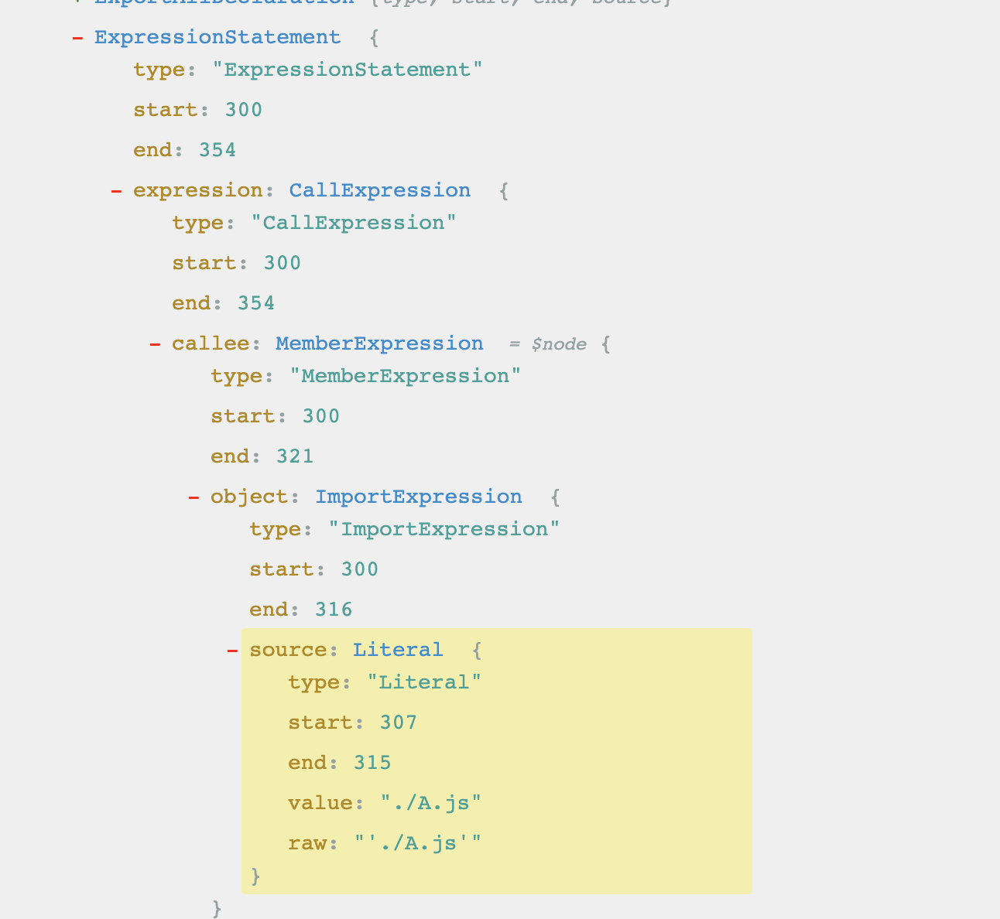
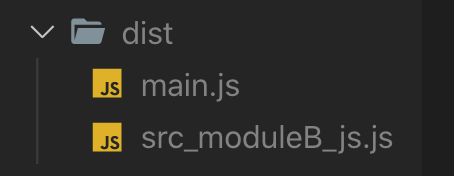

# import()分包原理

## 使用方式

例如：

```javascript
import('./A.js').then((res) => { console.log(res) })
```

## ast解析

使用`acorn`解析时会转换为`ExpressionStatement`，进一步分析为`MemberExpression`下的`ImportExpression`：



## hooks.importCall

解析完成后进行`walkStatement`，此时会触发`hooks.importCall`钩子。在`webpack/lib/dependencies/ImportParserPlugin.js`文件中：

```javascript
parser.hooks.importCall.tap("ImportParserPlugin", expr => {

  let chunkName = null;

  // ...省略
  const depBlock = new AsyncDependenciesBlock(
    {
      ...groupOptions,
      name: chunkName
    },
    expr.loc,
    param.string
  );
  const dep = new ImportDependency(param.string, expr.range, exports);
  dep.loc = expr.loc;
  depBlock.addDependency(dep);
  parser.state.current.addBlock(depBlock);

  return true;

});
```

最终会创建一个`AsyncDependenciesBlock`，并通过`addBlock`添加，最终添加到`module.blocks`属性上。异步组件`module`的`parentBlock`指向的是`AsyncDependenciesBlock`。

## seal 阶段

在`seal`阶段中解析下一层引用`modules`时，调用`webpack/buildChunkGraph.js`文件中的`extractBlockModules`方法：

```javascript
const queue = [module];
while (queue.length > 0) {
  const block = queue.pop();
  const arr = [];
  arrays.push(arr);
  blockModulesMap.set(block, arr);
  for (const b of block.blocks) {
    queue.push(b);
  }
}
```

此时会遍历`blocks`形成如下结构数组结构：不同的`block`对应于不同的`module`。


接着在`processBlock`结尾处，会对`module.block`进行遍历：

```javascript
for (const b of block.blocks) {
  iteratorBlock(b);
}

if (block.blocks.length > 0 && module !== block) {
  blocksWithNestedBlocks.add(block);
}
```

此时如果没有对应的`chunkGroup`，则会进行创建：

```javascript
cgi = namedChunkGroups.get(chunkName);
if (!cgi) {
  c = compilation.addChunkInGroup(
    b.groupOptions || b.chunkName,
    module,
    b.loc,
    b.request
  );
}
```

因此最终`compilation.chunks`和`compilation.chunkGroups`的值中将不止一个`chunk/chunkGroup`。最终也会根据`chunk`生成单独的文件。

## emit阶段

这里以这一段代码为例：

```javascript
// index.js 文件
import('./moduleB.js').then((res) => {
  console.log(res)
})

// moduleB.js 文件
export function B() {
  console.log('==> module B');
}
```

此时会生成两个文件：



分包后的代码会独自生成一个文件，而在`main`文件中，打包后的`import()`语句则会变为：

```javascript
// 整理后的代码大致如下：
__webpack_require__.e("src_moduleB_js")
  .then(__webpack_require__.bind(__webpack_require__,"./src/moduleB.js"))
 .then((res) => {console.log(res)}));
```

接下来看下代码的具体执行过程。

## 代码执行初始化

### installedChunks

先找到`/* webpack/runtime/jsonp chunk loading */`这个注释的闭包函数，首先会定义一个`installedChunks`变量

```javascript
var installedChunks = {
  "main": 0
};
```

该变量是一个对象，`key`为`chunk`的`key`，值为`0`代表已经加载完成，否则值为`[resolve, reject, Promise]`形式。

### __webpack_require__.f.j

`__webpack_require__.f.j`在`.f`属性上定义了一个`j`函数，在后面会用到。

### webpackJsonpCallback

```javascript
// 定义webpackJsonpCallback
var webpackJsonpCallback = (parentChunkLoadingFunction, data) => {
  // ...
}

// 定义一个全局变量，该变量在其他chunk里同样能访问
var chunkLoadingGlobal = self["webpackChunkstudy_webpack"] = self["webpackChunkstudy_webpack"] || [];
chunkLoadingGlobal.forEach(webpackJsonpCallback.bind(null, 0));
// 1. 将数组的 原生push 当做参数传入
// 2. 重写chunkLoadingGlobal.push 方法
chunkLoadingGlobal.push = webpackJsonpCallback.bind(null, chunkLoadingGlobal.push.bind(chunkLoadingGlobal));
```

当初始化完成后，开始加载`index.js`文件，此时会执行`__webpack_require__.e("src_moduleB_js")`。

## 引入模块（__webpack_require__.e）

```javascript
(() => {
  __webpack_require__.f = {};
  __webpack_require__.e = (chunkId) => {
    return Promise.all(Object.keys(__webpack_require__.f).reduce((promises, key) => {
      __webpack_require__.f[key](chunkId, promises);
      return promises;
    }, []));
  };
})();
```

该函数相当于遍历`.f`对象，并执行各个函数，前面初始化时已经定义了`.j`函数。因此会执行`__webpack_require__.f.j`函数。

## 封装Promise(__webpack_require__.f.j/l)

```javascript
__webpack_require__.f.j = (chunkId, promises) => {
  var installedChunkData = __webpack_require__.o(installedChunks, chunkId) ? installedChunks[chunkId] : undefined;
  if (installedChunkData !== 0) {
    if (installedChunkData) {
      promises.push(installedChunkData[2]);
    } else {
      if (true) { 
        var promise = new Promise((resolve, reject) => (installedChunkData = installedChunks[chunkId] = [resolve, reject]));
        promises.push(installedChunkData[2] = promise);
        __webpack_require__.l(url, loadingEnded, "chunk-" + chunkId, chunkId);

      } else installedChunks[chunkId] = 0;
    }
  }
};
```

该函数会先判断`installedChunks`中该`chunk`对应的值是否为`0`，如果为`0`，说明已经加载好了，只需要把原来保存的`promise`返回即可。

否则的话需要创建一个`promise`对象，按照`[resolve, reject, Promise]`的形式添加到`promises`中，最后调用`__webpack_require__.l`正式加载模块。

## __webpack_require__.l

`__webpack_require__.l`精简代码如下：

```javascript
__webpack_require__.l = (url, done, key, chunkId) => {
  if (!script) {
    needAttach = true;
    script = document.createElement('script');
    script.charset = 'utf-8';
    script.setAttribute("data-webpack", dataWebpackPrefix + key);
    script.src = url;
  }
  var onScriptComplete = (prev, event) => {
    script.parentNode && script.parentNode.removeChild(script);
  }
  needAttach && document.head.appendChild(script);
};
```

该方法会创建一个`script`标签，加入到`head`中，记载完成后就会移除该`script`。重要的就是这个加载过程了。

## 异步模块执行

来到`moduleB.js`打包后的文件中：

```javascript
(self["webpackChunkstudy_webpack"] = self["webpackChunkstudy_webpack"] || []).push([["src_moduleB_js"], {
"./src/moduleB.js": ((__unused_webpack_module, __webpack_exports__, __webpack_require__) => {
eval("__webpack_require__.r(__webpack_exports__);\n/* harmony export */ __webpack_require__.d(__webpack_exports__, {\n/* harmony export */   \"B\": () => (/* binding */ B)\n/* harmony export */ });\nfunction B() {\n  console.log('==> module B');\n}\n\n//# sourceURL=webpack://study-webpack/./src/moduleB.js?");
}]);
```

执行时会获取在初始化时定义的全局`webpackChunkstudy_webpack`，并调用`push`方法，由于`push`方法被重写了，此时实际上调用的就是之前的`webpackJsonpCallback`函数：

```javascript
var webpackJsonpCallback = (parentChunkLoadingFunction, data) => {
  var [chunkIds, moreModules, runtime] = data;
  var moduleId, chunkId, i = 0;
  if (chunkIds.some((id) => (installedChunks[id] !== 0))) {
    for (moduleId in moreModules) {
      if (__webpack_require__.o(moreModules, moduleId)) {
        // 1. 将新加载的模块代码添加到全局模块当中
        __webpack_require__.m[moduleId] = moreModules[moduleId];
      }
    }
    if (parentChunkLoadingFunction) parentChunkLoadingFunction(data);
    for (;i < chunkIds.length;i++) {
      chunkId = chunkIds[i];
      if (__webpack_require__.o(installedChunks, chunkId) && installedChunks[chunkId]) {
        // 2. 执行 promise[0]，也就是 resolve 函数
        installedChunks[chunkId][0]();
      }
      // 3. 标识该 chunk 已经加载完成
      installedChunks[chunkIds[i]] = 0;
    }
  }
}
```

该函数主要将加载完的模块代码放到`__webpack_modules__`对象当中。这样调用`resolve`后，再次执行`__webpack_require__`时就能找到对应的模块了。

## 总结

`import()`分包原理大致如下：

1. `ast`解析时分析为调用的`import()`方法。
2. 进行`walkStatement`时，触发`hooks.importCall`钩子，建立`Async`的`Dependency`存放到`blocks`属性当中。
3. 在生成`chunks`的时候会去遍历`blocks`，单独生成`chunks`。
4. 生成的代码执行时：
   1. 初始化一些参数，比如`webpackJsonpCallback`以及`chunkLoadingGlobal`等等。
   2. 执行`__webpack_require__.e`判断模块是否已经加载，如果未加载会创建一个`promise`。
   3. 调用`__webpack_require__.l`创建`script`标签加载`chunk`。
   4. 执行`chunk`代码时调用`push`方法将引用到的模块传给`webpackJsonpCallback`。然后将该模块记录到`__webpack_modules__`中。随后执行`__webpack_require__`加载该模块。
