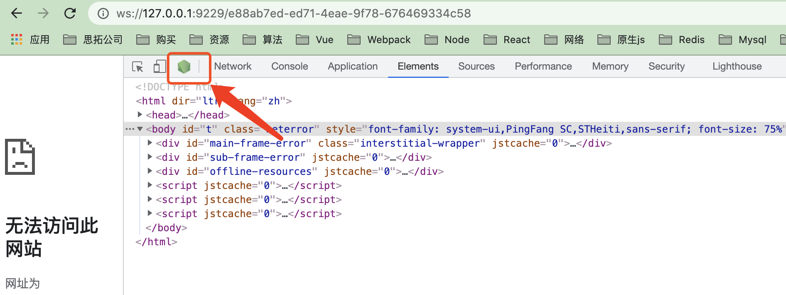
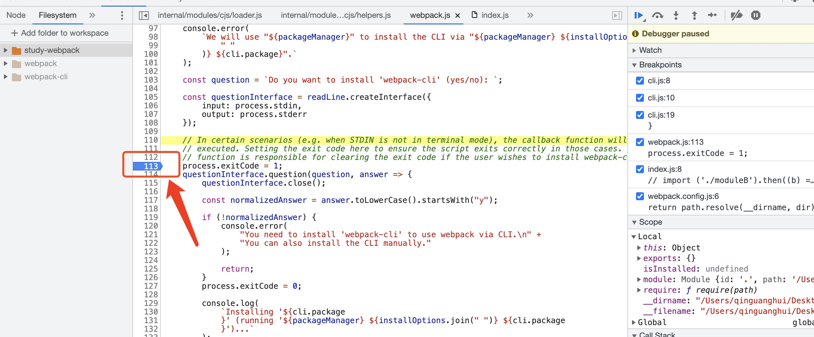

# Webpack 源码调试

## 安装webpack/webpack-cli

```javascript
"devDependencies": {
  "webpack": "^5.33.2",
  "webpack-cli": "^4.6.0"
}
```

## 添加inspect

找到`node_modules/.bin/`目录，分别在`webpack.js`和`webpack-cli.js`文件的首行后面添加`--inspect-brk`：

```javascript
// 添加前
#!/usr/bin/env node
// 添加后
#!/usr/bin/env node --inspect-brk
```

## 运行webpack

定义`webpack.config.js`文件 ，然后在`package.json`中定义打包命令：

```javascript
"scripts": {
  "build": "webpack"
},
```

运行`npm run build`进行打包，命令窗口会出现以下内容：

```javascript
Debugger listening on ws://127.0.0.1:9229/8d04b555-653d-45b0-9d19-00f63aed08b1
For help, see: https://nodejs.org/en/docs/inspector
```

## chrome调试

访问`ws://127.0.0.1:9229/8d04b555-653d-45b0-9d19-00f63aed08b1`网址并打开`chrome`控制台:



会出现`node`的`logo`，点击该`logo`，即可开始打断点调试：



## vscode调试
如果想在`vscode`中调试，手写需要按`chrome`调试的方法完整操作一遍。然后在`vscode`中下载`chrome`调试插件：`Debugger for Chrome`。下载完成后点击插件提供的运行按钮，选择`node`环境。在`.vscode/`目录下会生成一个`launch.json`文件，将文件替换成一下内容：

```javascript
{
  "version": "0.2.0",
    "configurations": [
      {
        "type": "pwa-node",
        "request": "launch",
        "name": "Debug webpack",
        "skipFiles": [
          "<node_internals>/**"
        ],
        "program": "${workspaceFolder}/index.js"
      }
    ]
}
```

最终就可以在`vscode`中调试了：


## 参考文章

- [https://segmentfault.com/a/1190000023734819](https://segmentfault.com/a/1190000023734819)